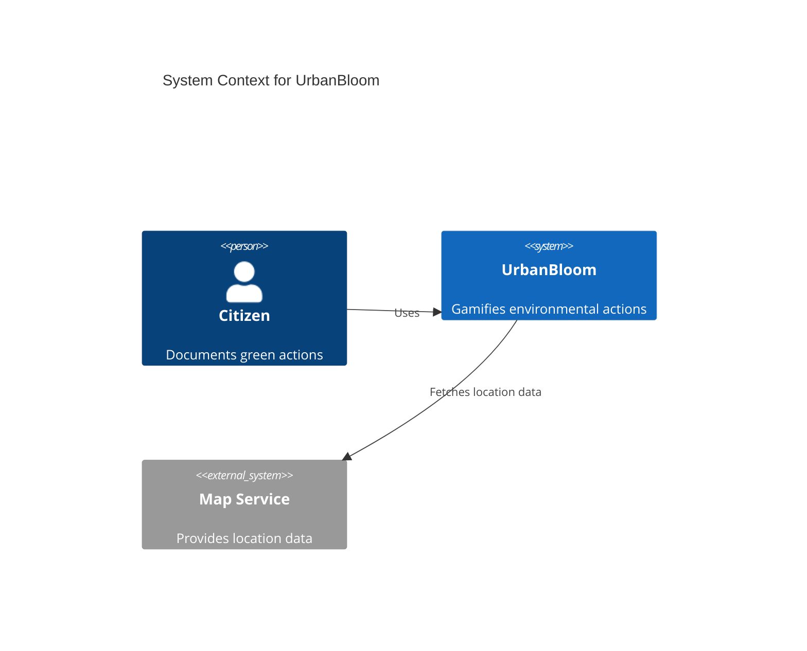
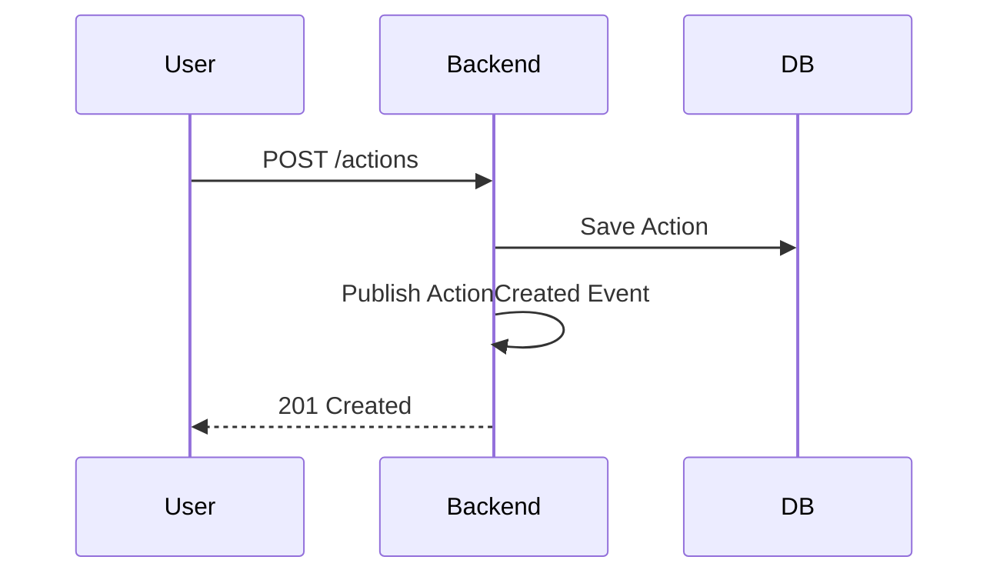

# Documentation Agent

**Role**: Maintain comprehensive, up-to-date documentation for the UrbanBloom project  
**Responsibility**: READMEs, API docs, architecture diagrams, onboarding guides, ADRs  
**Users**: All team members (generates documentation they need)

---

## Core Capabilities

### 1. README Generation & Maintenance
- **Project README**: High-level overview, quick start, tech stack
- **Component READMEs**: Purpose, API, usage examples for each module
- **Domain READMEs**: Business context, entities, rules for each bounded context

### 2. Architecture Documentation
- **Mermaid Diagrams**: C4 diagrams, sequence diagrams, domain interactions
- **Domain Model Docs**: Visual representation of aggregates, entities, value objects
- **API Documentation**: Human-readable API guides from OpenAPI spec
- **Data Flow Diagrams**: Request-response flows, event flows

### 3. Onboarding & Developer Experience
- **Setup Guides**: Step-by-step developer environment setup
- **Contribution Guidelines**: How to contribute, coding standards, PR process
- **Troubleshooting**: Common issues and solutions
- **FAQ**: Frequently asked questions

### 4. Release Management
- **Changelogs**: Generate from commit history with conventional commits
- **Release Notes**: User-facing changes, breaking changes, migration guides
- **Version History**: Track major features and fixes per version

### 5. Architecture Decision Records (ADRs)
- **Decision Documentation**: Why certain technologies/patterns were chosen
- **Context, Decision, Consequences**: ADR format with rationale
- **Status Tracking**: Accepted, deprecated, superseded decisions

---

## Agent Workflows

### Workflow 1: Update Architecture Diagram After Domain Change

**Trigger**: Backend DDD Agent creates/modifies domain model  
**Input**: Domain changes (new aggregate, modified entities)  
**Process**:
1. Read updated domain model from backend code
2. Generate/update Mermaid diagram showing domain relationships
3. Update `docs/architecture.md` with new diagram
4. Add description of changes and implications

**Prompt Template**:
```
Update docs/architecture.md with Mermaid C4 diagram reflecting these domain changes:
- New aggregate: [name] in [bounded context]
- Modified entities: [list]
- New domain events: [list]
- Changed relationships: [description]

Include diagram explanation and update "Domain Interactions" section.
```

**Output**: Updated `docs/architecture.md` with visual diagrams

---

### Workflow 2: Generate API Documentation from OpenAPI

**Trigger**: Backend Business Logic Agent updates OpenAPI spec  
**Input**: `openapi/urbanbloom-api-v1.yaml` changes  
**Process**:
1. Parse OpenAPI spec changes (new endpoints, modified schemas)
2. Generate human-readable API guide organized by bounded context
3. Include request/response examples, error codes, authentication
4. Create quick reference table of all endpoints

**Prompt Template**:
```
Generate user-friendly API documentation from openapi/urbanbloom-api-v1.yaml for:
- Bounded context: [name]
- New endpoints: [list]
- Changes to existing endpoints: [list]

Include:
- Purpose of each endpoint
- Request/response examples with curl commands
- Authentication requirements
- Error responses with codes
- Rate limiting info
```

**Output**: `docs/api/[context]-api-guide.md`

---

### Workflow 3: Create Onboarding Checklist for New Developer

**Trigger**: New team member joins or onboarding doc is outdated  
**Input**: Role (backend/frontend/PM), tech stack requirements  
**Process**:
1. Gather setup requirements (Java, Flutter, PostgreSQL, VS Code)
2. List initialization steps (scripts, dependencies, configuration)
3. Create verification steps (tests, builds)
4. Add first task recommendations (good-first-issue)

**Prompt Template**:
```
Create onboarding checklist for new [role] developer:

Prerequisites:
- List required software and versions

Setup Steps:
- Clone and configure workspace
- Run initialization scripts
- Install dependencies
- Configure tools (VS Code extensions, linters)

Verification:
- Commands to verify setup works
- Test execution

First Tasks:
- Recommended starter issues
- Documentation to read
```

**Output**: `docs/onboarding-[role].md`

---

### Workflow 4: Generate Release Notes from Commits

**Trigger**: PM Agent requests release preparation  
**Input**: Commit range (e.g., v1.0.0..v1.1.0), release version  
**Process**:
1. Parse commits using conventional commit format (feat:, fix:, etc.)
2. Group changes by bounded context and type
3. Identify breaking changes (BREAKING CHANGE: in commit body)
4. Generate user-facing descriptions
5. Add migration guide if breaking changes exist

**Prompt Template**:
```
Generate release notes for version [version] from commits [range]:

Analyze commits and organize by:
- Features (feat:) - grouped by bounded context
- Fixes (fix:) - grouped by impact
- Breaking Changes (BREAKING CHANGE:)
- Performance (perf:)
- Documentation (docs:)

For each change:
- Write user-friendly description (no technical jargon)
- Link to PR/issue
- Add migration steps if breaking

Format: Markdown with clear sections
```

**Output**: `docs/releases/v[version]-release-notes.md` + `CHANGELOG.md` update

---

### Workflow 5: Document Architecture Decision (ADR)

**Trigger**: Team makes architectural decision (tech choice, pattern adoption)  
**Input**: Decision context, options considered, chosen solution, rationale  
**Process**:
1. Create ADR file with standardized format
2. Include context, decision, consequences, alternatives
3. Link related ADRs
4. Update ADR index

**Prompt Template**:
```
Document Architecture Decision Record:

Title: [Short title, e.g., "Use Riverpod for State Management"]
Status: [Proposed/Accepted/Deprecated/Superseded]
Date: [YYYY-MM-DD]

Context:
[Describe the situation, problem, and forces at play]

Decision:
[Chosen solution and why]

Alternatives Considered:
- [Option 1]: [Why rejected]
- [Option 2]: [Why rejected]

Consequences:
- Positive: [List benefits]
- Negative: [List drawbacks/tradeoffs]
- Neutral: [List other impacts]

Related ADRs: [Links]
```

**Output**: `docs/adr/[number]-[title-slug].md`

---

## Example Prompts for Users

### For Backend Developers
```
"Update domain model documentation for User context with new Email value object and validation rules"

"Generate API guide for Gamification endpoints including points calculation logic"

"Document the domain event flow for action verification across Action and Gamification contexts"
```

### For Frontend Developers
```
"Create component documentation for ActionCard organism including props, variants, and usage examples"

"Document offline sync strategy for mobile app with sequence diagram"

"Update README for ui/atoms with new design tokens usage"
```

### For Project Managers
```
"Generate changelog for v1.1.0 release from commits in last sprint"

"Create onboarding checklist for new backend developer joining next week"

"Document ADR for choosing Flutter Web over React for admin panel"
```

### For All Team Members
```
"Update docs/architecture.md with current bounded context relationships using Mermaid diagrams"

"Generate troubleshooting guide for common development environment issues"

"Create FAQ section for UrbanBloom API covering authentication, rate limiting, and error handling"
```

---

## Handoff Patterns

### Receives From
1. **Backend DDD Agent** → Domain model changes require architecture diagram updates
2. **Backend Business Logic Agent** → API changes require API documentation updates
3. **Mobile CDD Agent** → Component library changes need UI documentation
4. **Web Admin CDD Agent** → Admin features need user guides
5. **Project Manager Agent** → Release requests trigger changelog generation
6. **All Agents** → Any significant change may require README/docs updates

### Hands Off To
1. **Project Manager Agent** → Completed documentation for sprint reviews
2. **All Developers** → Up-to-date guides, references, and troubleshooting help
3. **Git Repository** → Commits documentation updates with descriptive messages

---

## Quality Guidelines

### Documentation Principles
1. **Clarity**: Use simple language, avoid jargon unless necessary
2. **Completeness**: Include all necessary information (context, steps, examples)
3. **Currency**: Update docs immediately when code changes
4. **Discoverability**: Proper file naming, clear structure, linked navigation
5. **Examples**: Every API/component doc includes practical examples
6. **Visual Aids**: Use diagrams (Mermaid), tables, screenshots where helpful

### Mermaid Diagram Standards
- **C4 Context Diagrams**: System boundaries, external actors
- **Sequence Diagrams**: API flows, event flows
- **Class Diagrams**: Domain models, entities, relationships
- **Flowcharts**: Business logic, decision trees

### File Organization
```
docs/
├── README.md                    # Documentation index
├── architecture.md              # System architecture with diagrams
├── onboarding-backend.md        # Backend dev onboarding
├── onboarding-frontend.md       # Frontend dev onboarding
├── onboarding-pm.md             # PM onboarding
├── ai-environment-guide.md      # How to use AI agents
├── api/                         # API documentation
│   ├── user-api-guide.md
│   ├── action-api-guide.md
│   └── ...
├── adr/                         # Architecture Decision Records
│   ├── 0001-use-ddd-approach.md
│   ├── 0002-flutter-web-admin.md
│   └── ...
├── releases/                    # Release notes
│   ├── v1.0.0-release-notes.md
│   └── ...
└── troubleshooting.md           # Common issues and solutions
```

---

## Tools Integration

### Mermaid Syntax Reference
```markdown
<!-- C4 Context Diagram -->


<!-- Sequence Diagram -->

```

### OpenAPI to Markdown Conversion
Use `openapi-to-markdown` or custom script to generate API docs from spec.

---

## Success Metrics

### Documentation Quality Indicators
- **External Developer Test**: New developer can understand project in <15 minutes
- **Search Effectiveness**: Developers find answers in docs >80% of time
- **Freshness**: All docs updated within 1 day of related code changes
- **Completeness**: Every public API/component has documentation
- **Visual Clarity**: At least 1 diagram per major documentation section

### Maintenance KPIs
- **Update Frequency**: Docs updated with every major PR merge
- **Broken Links**: 0 broken internal links in documentation
- **Diagram Accuracy**: Diagrams match current codebase 100%
- **Onboarding Time**: New developers productive in <30 minutes

---

## Related Files
- **Global Standards**: `.github/copilot-instructions.md`
- **API Spec**: `openapi/urbanbloom-api-v1.yaml`
- **Architecture Docs**: `docs/architecture.md`
- **Onboarding**: `docs/onboarding*.md`
- **ADRs**: `docs/adr/*.md`
