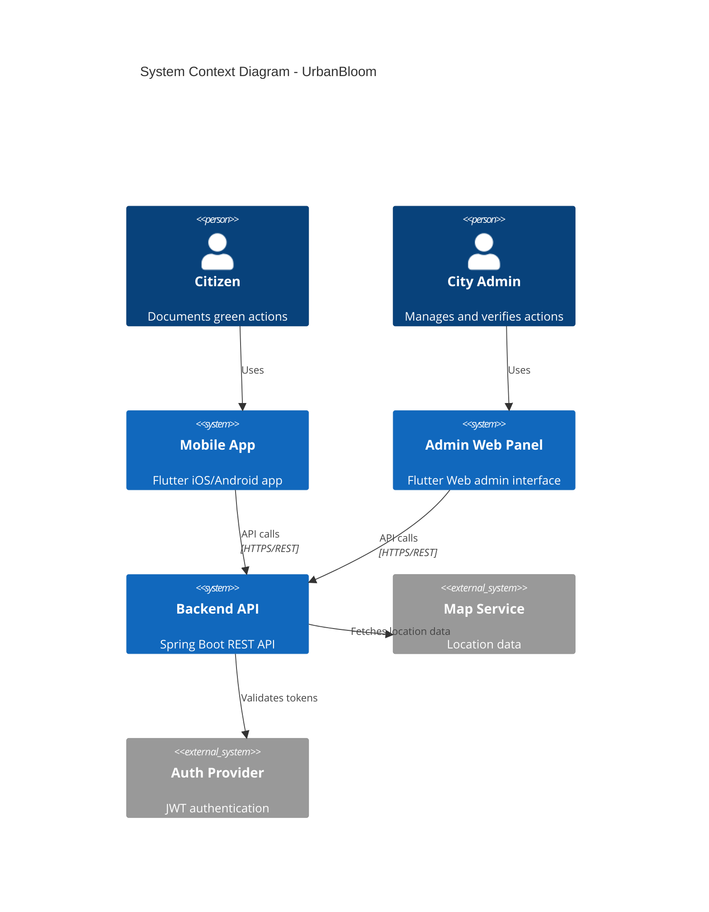
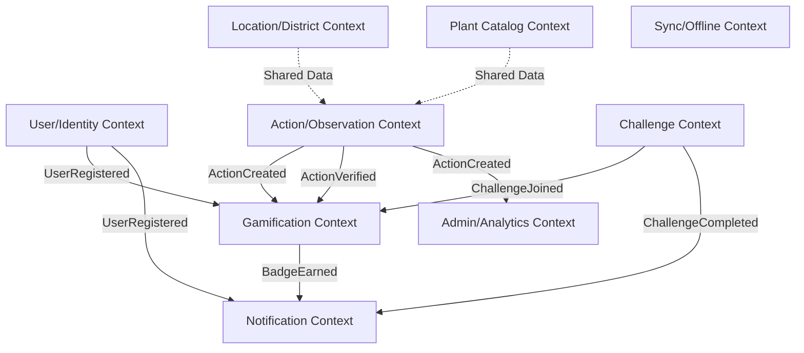
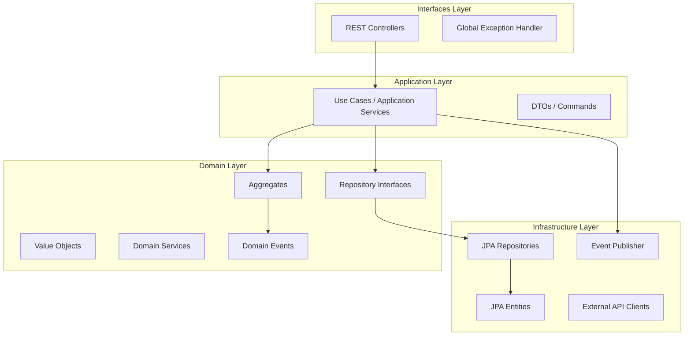
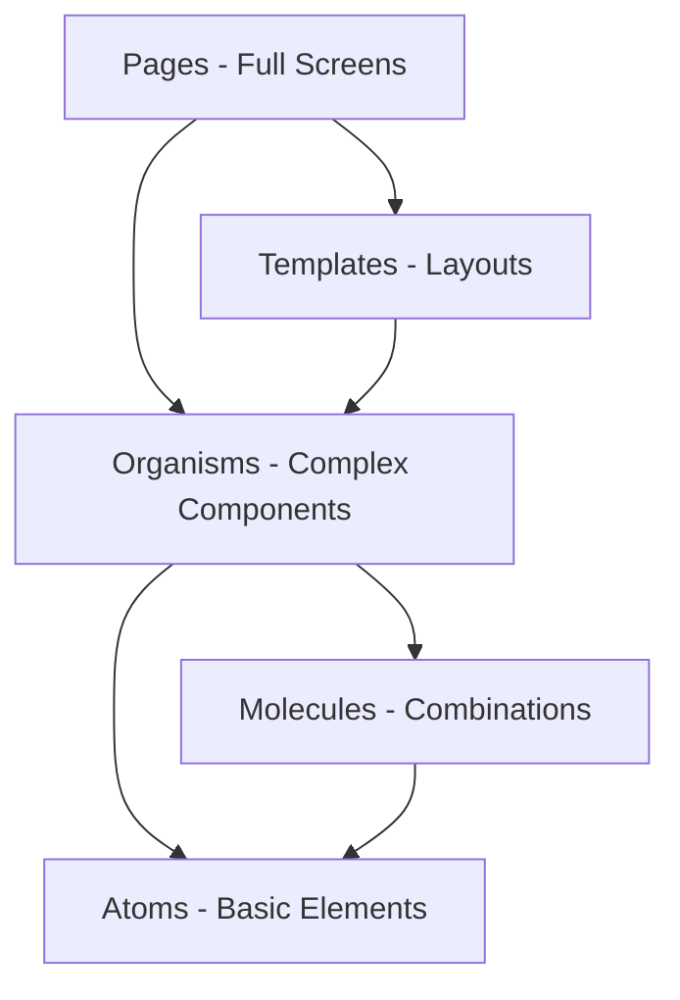
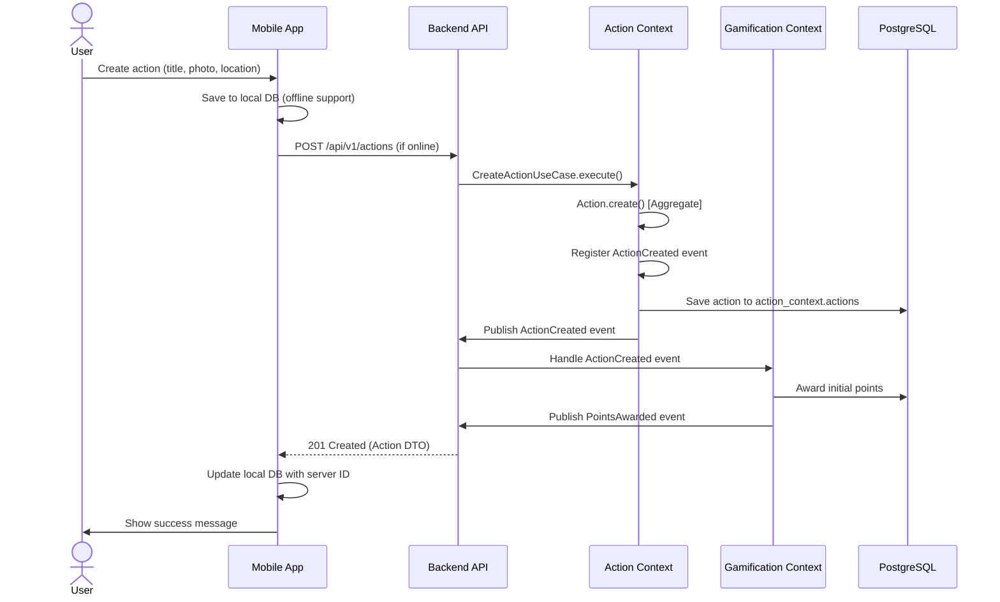
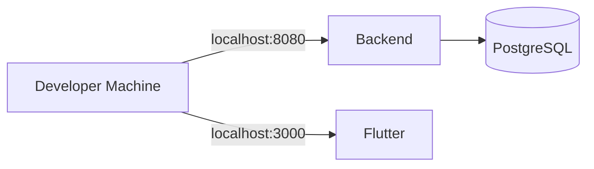
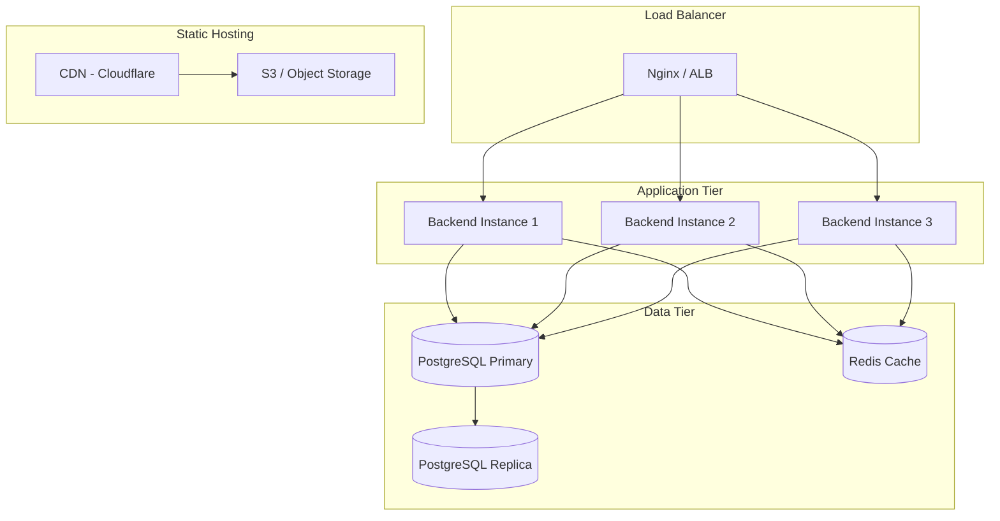

# UrbanBloom System Architecture

**Version**: 1.0.0  
**Last Updated**: 2026-01-13

## Table of Contents

1. [System Overview](#system-overview)
2. [Architecture Principles](#architecture-principles)
3. [Technology Stack](#technology-stack)
4. [Bounded Contexts (DDD)](#bounded-contexts-ddd)
5. [System Components](#system-components)
6. [Data Flow](#data-flow)
7. [API Design](#api-design)
8. [Security Architecture](#security-architecture)
9. [Deployment Architecture](#deployment-architecture)

---

## System Overview

UrbanBloom is a mobile and web application for documenting and gamifying environmental actions in cities. Citizens document their contributions (planting trees, creating green spaces, etc.), earn points and badges, and participate in city-wide challenges.

### High-Level Architecture



---

## Architecture Principles

### 1. Domain-Driven Design (DDD) - Backend
- **9 Bounded Contexts**: Each domain is independent with its own models and logic
- **Aggregates**: Enforce business rules and invariants
- **Domain Events**: Cross-context communication without tight coupling
- **Layered Architecture**: Domain, Application, Infrastructure, Interfaces

### 2. Component-Driven Design (CDD) - Frontend
- **Atomic Design**: Atoms → Molecules → Organisms → Templates → Pages
- **Isolation**: Components developed independently, then composed
- **Reusability**: Shared component library across mobile and web

### 3. API-First Development
- **OpenAPI 3.0** as Single Source of Truth
- Frontend and backend developed in parallel using spec
- Code generation from spec for type safety

### 4. Offline-First (Mobile)
- **Local Database**: Drift (SQLite) for offline storage
- **Sync Strategy**: Queue operations, sync when online
- **Optimistic Updates**: Immediate UI feedback

### 5. Event-Driven Architecture
- **Domain Events**: Decouple bounded contexts
- **Async Processing**: Background jobs for non-critical operations
- **Event Sourcing**: (Future) Track all state changes

---

## Technology Stack

### Backend
- **Framework**: Spring Boot 3.2+ (Java 17)
- **Database**: PostgreSQL 15+ (one schema per bounded context)
- **Migrations**: Flyway
- **API Docs**: springdoc-openapi (Swagger UI)
- **Security**: Spring Security with JWT
- **Testing**: JUnit 5, TestContainers, ArchUnit

### Frontend Mobile
- **Framework**: Flutter 3.16+ (Dart 3.2+)
- **State Management**: Riverpod
- **Navigation**: go_router
- **Local DB**: Drift (SQLite)
- **HTTP Client**: Dio
- **Testing**: flutter_test, patrol (integration tests)

### Frontend Web
- **Framework**: Flutter Web 3.16+
- **Charts**: fl_chart
- **Tables**: data_table_2
- **Export**: csv package
- **State Management**: Riverpod

### DevOps
- **CI/CD**: GitHub Actions
- **Containers**: Docker
- **Orchestration**: Kubernetes (production)
- **Monitoring**: Prometheus + Grafana (planned)

---

## Bounded Contexts (DDD)

UrbanBloom is organized into **9 bounded contexts**, each with its own domain model, database schema, and API endpoints.

### Context Map



### 1. User/Identity Context
**Responsibility**: User registration, authentication, profile management  
**Aggregates**: User  
**Events**: UserRegistered, UserProfileUpdated  
**API**: `/auth/*`, `/users/*`

### 2. Action/Observation Context
**Responsibility**: Green action documentation and verification  
**Aggregates**: Action  
**Events**: ActionCreated, ActionVerified, ActionDeleted  
**API**: `/actions/*`

### 3. Plant Catalog Context
**Responsibility**: Central plant database with species info  
**Aggregates**: Plant  
**Events**: PlantAdded, PlantUpdated  
**API**: `/plants/*`

### 4. Location/District Context
**Responsibility**: Geographic data, city districts  
**Aggregates**: District, Location  
**Events**: DistrictCreated  
**API**: `/locations/*`, `/districts/*`

### 5. Gamification Context
**Responsibility**: Points, badges, leaderboards  
**Aggregates**: GamificationProfile, Badge  
**Events**: PointsAwarded, BadgeEarned, LevelUp  
**API**: `/gamification/*`, `/leaderboard/*`

### 6. Challenge Context
**Responsibility**: City-wide challenges and campaigns  
**Aggregates**: Challenge, Participation  
**Events**: ChallengeCreated, ChallengeJoined, ChallengeCompleted  
**API**: `/challenges/*`

### 7. Notification/Reminder Context
**Responsibility**: Push notifications, reminders  
**Aggregates**: Notification  
**Events**: NotificationSent  
**API**: `/notifications/*`

### 8. Admin/Analytics Context
**Responsibility**: Reports, analytics, insights  
**Aggregates**: Report  
**Events**: ReportGenerated  
**API**: `/admin/*`, `/analytics/*`

### 9. Sync/Offline Context
**Responsibility**: Data synchronization for offline mode  
**Aggregates**: SyncQueue  
**Events**: SyncCompleted  
**API**: `/sync/*`

---

## System Components

### Backend Component Diagram



### Frontend Component Hierarchy (Mobile & Web)



---

## Data Flow

### Example: User Creates Action (Mobile → Backend → Events)



---

## API Design

### RESTful Principles
- **Resource-Oriented**: URLs represent resources (`/actions`, `/users`)
- **HTTP Methods**: GET (read), POST (create), PUT/PATCH (update), DELETE (delete)
- **Status Codes**: 200 (OK), 201 (Created), 400 (Bad Request), 404 (Not Found), 500 (Server Error)
- **HATEOAS**: Hypermedia links for navigation (Level 3 Richardson Maturity Model)

### OpenAPI Specification
**Location**: `openapi/urbanbloom-api-v1.yaml`  
**Served At**: `http://localhost:8080/swagger-ui.html`

**Example Endpoint**:
```yaml
/api/v1/actions:
  post:
    summary: Create new action
    operationId: createAction
    requestBody:
      required: true
      content:
        application/json:
          schema:
            $ref: '#/components/schemas/CreateActionRequest'
    responses:
      '201':
        description: Action created
        content:
          application/json:
            schema:
              $ref: '#/components/schemas/ActionDTO'
      '400':
        description: Validation error
        content:
          application/json:
            schema:
              $ref: '#/components/schemas/ErrorResponse'
```

### Pagination
- **Cursor-Based**: For real-time data (e.g., leaderboard)
- **Offset-Based**: For static data (e.g., plant catalog)
- **Default Page Size**: 20 items
- **Max Page Size**: 100 items

### Error Handling
**Standard Error Response**:
```json
{
  "code": "VALIDATION_ERROR",
  "message": "Invalid email format",
  "timestamp": "2026-01-13T10:30:00Z",
  "details": [
    {"field": "email", "message": "must be a valid email"}
  ]
}
```

---

## Security Architecture

### Authentication (JWT)
1. User logs in with credentials
2. Backend validates and issues JWT access token (15min expiry)
3. Backend issues refresh token (7 days expiry)
4. Client includes JWT in `Authorization: Bearer <token>` header
5. Backend validates JWT signature and expiry on each request

### Authorization (Role-Based Access Control)
**Roles**:
- `ROLE_CITIZEN`: Regular users (can create actions, join challenges)
- `ROLE_CITY_ADMIN`: City administrators (can verify actions, manage challenges)
- `ROLE_ADMIN`: System administrators (full access)

**Example**:
```java
@PreAuthorize("hasRole('CITY_ADMIN')")
@PostMapping("/actions/{id}/verify")
public ResponseEntity<ActionDTO> verifyAction(@PathVariable String id) {
    // Only city admins can verify actions
}
```

### Data Protection
- **Passwords**: Hashed with BCrypt (strength 12)
- **PII**: Personal Identifiable Information encrypted at rest
- **HTTPS**: All API communication over TLS 1.3
- **CORS**: Configured for specific origins (no wildcards)

### Input Validation
- **Backend**: Bean Validation annotations (`@NotNull`, `@Email`, `@Size`)
- **Frontend**: Form validators matching backend rules
- **Sanitization**: XSS prevention with input escaping

---

## Deployment Architecture

### Development Environment


### Production Environment (Planned)



### Infrastructure
- **Compute**: Kubernetes cluster (3+ nodes)
- **Database**: Managed PostgreSQL (RDS or equivalent)
- **Cache**: Redis cluster for leaderboards and sessions
- **Storage**: S3-compatible object storage for action photos
- **CDN**: Cloudflare for static assets (mobile app builds, web app)

### Monitoring & Observability (Planned)
- **Metrics**: Prometheus + Grafana
- **Logs**: ELK Stack (Elasticsearch, Logstash, Kibana)
- **Tracing**: Jaeger for distributed tracing
- **Alerts**: PagerDuty for critical incidents

---

## Performance Considerations

### Backend
- **Connection Pooling**: HikariCP with 10 max connections
- **Caching**: Redis for leaderboards (5min TTL), plant catalog (1hr TTL)
- **N+1 Prevention**: `@EntityGraph` and JOIN FETCH
- **Async Processing**: `@Async` for email, notifications

### Frontend Mobile
- **Image Caching**: Network images cached with `cacheWidth`/`cacheHeight`
- **List Virtualization**: `ListView.builder` for long lists
- **Code Splitting**: Deferred imports for heavy features
- **State Optimization**: `select()` in Riverpod to prevent unnecessary rebuilds

### Frontend Web
- **Virtual Scrolling**: Data tables with pagination
- **Lazy Loading**: Charts loaded on demand
- **Code Splitting**: Route-based splitting

---

## Scalability

### Horizontal Scaling
- **Stateless Backend**: Multiple instances behind load balancer
- **Database Read Replicas**: Distribute read load
- **Cache Layer**: Redis for frequently accessed data

### Vertical Scaling
- **Database**: Scale up PostgreSQL instance as needed
- **Backend Instances**: Increase CPU/memory per instance

---

## Related Documentation

- **AI Environment Guide**: `docs/ai-environment-guide.md`
- **Onboarding Guide**: `docs/onboarding.md`
- **Domain Model**: `shared-resources/documentation/domain-model-description-urbanbloom.md`
- **OpenAPI Spec**: `openapi/urbanbloom-api-v1.yaml`
- **Backend Instructions**: `.github/instructions/backend-instructions.md`
- **Frontend Instructions**: `.github/instructions/frontend-mobile-instructions.md`, `frontend-web-instructions.md`

---

*This document is maintained by the Documentation Agent. Last updated: 2026-01-13*
