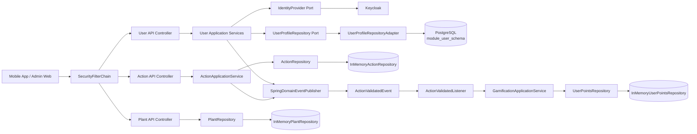
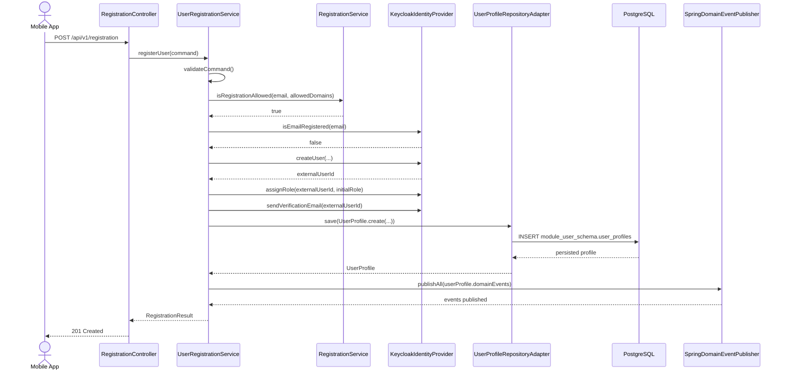

# Backend Overview

**Stand:** 2026-03-16  
**Scope:** aktueller Implementierungsstand in `Urban/server`

## Ziel dieses Dokuments

Dieses Dokument fasst den aktuell implementierten Backend-Stand zusammen. Es beschreibt:

- die aktive Architektur im Spring-Boot-Backend
- die wichtigsten Module und ihre Verantwortungen
- die derzeit verfuegbaren REST-Endpunkte
- Authentifizierung, Persistenz und Event-Flows
- zwei Diagramme auf Basis des echten Codes

## Architektur in einem Satz

Das Backend ist als modularer Monolith mit DDD- und Hexagonal-Ansatz aufgebaut: Controller rufen Application Services auf, diese arbeiten mit Domain-Objekten und Ports, waehrend Adapter die Anbindung an Keycloak, JPA oder In-Memory-Repositories uebernehmen.

## Aktive Module

| Modul | Rolle | Status | Wichtige Klassen |
| --- | --- | --- | --- |
| `shared` | Gemeinsame DDD-Basis | aktiv | `AggregateRoot`, `DomainEvent`, `SpringDomainEventPublisher` |
| `module-user` | Registrierung, Login, Passwort-Reset, Profil | aktiv | `RegistrationController`, `AuthController`, `UserRegistrationService`, `KeycloakIdentityProvider` |
| `module-action` | Erfassung und Verifikation von Umweltaktionen | aktiv | `ActionController`, `ActionApplicationService`, `Action` |
| `module-gamification` | Punktevergabe | aktiv | `GamificationApplicationService`, `ActionValidatedListener`, `UserPoints` |
| `module-plant` | Pflanzenkatalog | aktiv | `PlantController`, `PlantRepository` |
| `server-app` | Spring-Boot-Start, Security, Flyway, OpenAPI | aktiv | `UrbanBloomApplication`, `SecurityConfig` |
| `module-location`, `module-challenge`, `module-notification`, `module-analytics`, `module-sync` | spaetere Fachmodule | aktuell nur strukturell vorbereitet | kein relevanter Runtime-Flow im Code |

## Wichtige technische Entscheidungen

### 1. Security

- Spring Security laeuft als stateless OAuth2 Resource Server.
- JWTs werden gegen Keycloak validiert.
- Oeffentlich erreichbar sind unter anderem:
  - `/api/v1/registration`
  - `/api/v1/auth/**`
  - `/health`
  - `/api/v1/app/info`
- Alle anderen Endpunkte erfordern ein gueltiges JWT.
- Rollen werden aus `realm_access.roles` und `resource_access.<client>.roles` nach `ROLE_<name>` gemappt.

### 2. Identity Provider

- Der User-Kontext kapselt Keycloak hinter dem Port `IdentityProvider`.
- Login, Logout, Refresh, User-Erstellung, Rollenvergabe und Passwort-Reset laufen ueber `KeycloakIdentityProvider`.
- Mobile-Login und Admin-Login verwenden getrennte Realms und Client-IDs.

### 3. Persistenz

- Das User-Modul ist das einzige Modul mit echter Datenbankpersistenz.
- `UserProfile` wird per JPA in PostgreSQL gespeichert.
- Flyway-Migrationen legen `module_user_schema.user_profiles` an.
- Action-, Plant- und Gamification-Daten liegen aktuell nur in In-Memory-Repositories und gehen nach einem Neustart verloren.

### 4. Moduluebergreifende Kommunikation

- Domain Events werden ueber `SpringDomainEventPublisher` auf Spring `ApplicationEventPublisher` abgebildet.
- Der aktuell sichtbare produktive Event-Flow ist:
  - `Action.validate()` registriert `ActionValidatedEvent`
  - `ActionValidatedListener` reagiert darauf
  - `GamificationApplicationService` vergibt Punkte

## Endpunkte mit aktuellem Nutzen

| Endpunkt | Methode | Zweck | Auth |
| --- | --- | --- | --- |
| `/api/v1/registration` | `POST` | Benutzer registrieren, Keycloak-User anlegen, lokales Profil speichern | nein |
| `/api/v1/auth/mobile/login` | `POST` | Mobile Login ueber Keycloak | nein |
| `/api/v1/auth/admin/login` | `POST` | Admin Login mit zusaetzlicher Rollenpruefung | nein |
| `/api/v1/auth/logout` | `POST` | Refresh Token invalidieren | nein |
| `/api/v1/auth/password/reset-request` | `POST` | Passwort-Reset-E-Mail ueber Keycloak ausloesen | nein |
| `/api/v1/users/me` | `GET` | Profil des aktuellen Users laden | ja |
| `/api/v1/actions` | `POST` | Neue Action anlegen | ja |
| `/api/v1/actions/{actionId}/verify` | `POST` | Action validieren und Punkte-Event ausloesen | ja |
| `/api/v1/plants` | `GET` | Pflanzenliste lesen | ja |
| `/api/v1/plants/{plantId}` | `GET` | Einzelne Pflanze lesen | ja |
| `/health` | `GET` | Healthcheck | nein |
| `/api/v1/app/info` | `GET` | App-Info | nein |

## Wichtige Implementierungsdetails

### Registrierung

Die Registrierung ist der fachlich vollstaendigste Flow im aktuellen Backend:

1. Request kommt in `RegistrationController` an.
2. `UserRegistrationService` validiert Eingaben und Domain-Allowlist.
3. Keycloak wird auf bestehende E-Mail geprueft.
4. Ein Benutzer wird in Keycloak erstellt.
5. Die initiale Rolle wird in Keycloak gesetzt.
6. Verifikationsmail wird ausgeloest.
7. Ein lokales `UserProfile` wird in PostgreSQL gespeichert.
8. Domain Events des Aggregats werden publiziert.

### Login und Profilaktivierung

- `loginMobile()` authentifiziert gegen den Mobile-Realm.
- Wenn ein lokales Profil existiert und noch inaktiv ist, wird es nach erfolgreichem Login lokal aktiviert.
- `loginAdmin()` authentifiziert gegen den Admin-Realm und prueft danach explizit die Rolle `ADMIN`.

### Actions und Gamification

- `createAction()` legt eine `Action` mit Status `DRAFT` an.
- `verifyAction()` ruft `submitForVerification()` auf.
- Eine Verifikation ist nur moeglich, wenn bereits ein `photoUrl` gesetzt ist.
- Im Service existiert zwar `uploadPhoto()`, im REST-Layer gibt es dafuer aktuell aber keinen Endpunkt.
- Die Verifikation fuehrt direkt zu `ActionValidatedEvent`, das Punkte im Gamification-Modul ausloest.

### Pflanzenkatalog

- Das Plant-Modul liefert aktuell Seed-Daten aus `InMemoryPlantRepository`.
- Die Pflanzen dienen als Referenzdaten fuer Actions.

## Diagramm 1: Backend-Modul- und Laufzeitbild

## Diagramm 2: Sequence Diagram fuer die Registrierung

## Betriebsrelevante Konfiguration

Die wichtigsten Properties liegen in `server-app/src/main/resources/application.properties`:

- Datenbank: `spring.datasource.*`
- Flyway: `spring.flyway.*`
- JWT-Validierung: `spring.security.oauth2.resourceserver.jwt.*`
- Keycloak Admin/API: `keycloak.*`
- Registrierung: `urbanbloom.registration.*`
- Mail: `spring.mail.*`

## Aktuelle Grenzen des Backends

- Nur das User-Modul persistiert dauerhaft in PostgreSQL.
- Action-, Plant- und Gamification-Daten sind nicht restart-sicher.
- Fuer Action-Fotos fehlt aktuell ein oeffentlicher Upload-Endpunkt.
- `verifyAction` ist derzeit nur allgemein authentifiziert; eine explizite Rollenpruefung fuer Admin-Verifikation ist im Controller noch nicht vorhanden.
- Mehrere Module sind im Maven-Parent und Component-Scan bereits vorgesehen, aber fachlich noch nicht umgesetzt.

## Relevante Quellbereiche

- `Urban/server/server-app/src/main/java/com/urbanbloom/app`
- `Urban/server/module-user/src/main/java/com/urbanbloom/user`
- `Urban/server/module-action/src/main/java/com/urbanbloom/action`
- `Urban/server/module-gamification/src/main/java/com/urbanbloom/gamification`
- `Urban/server/module-plant/src/main/java/com/urbanbloom/plant`
