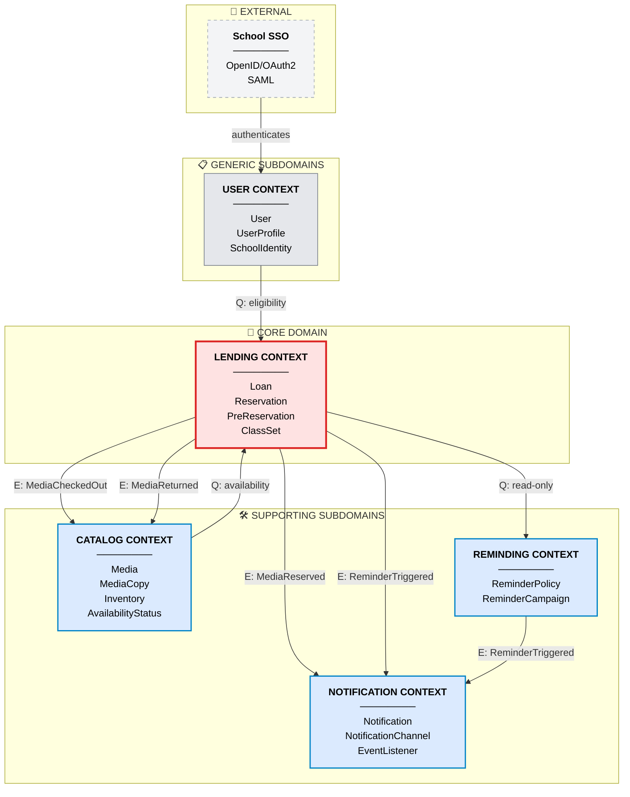
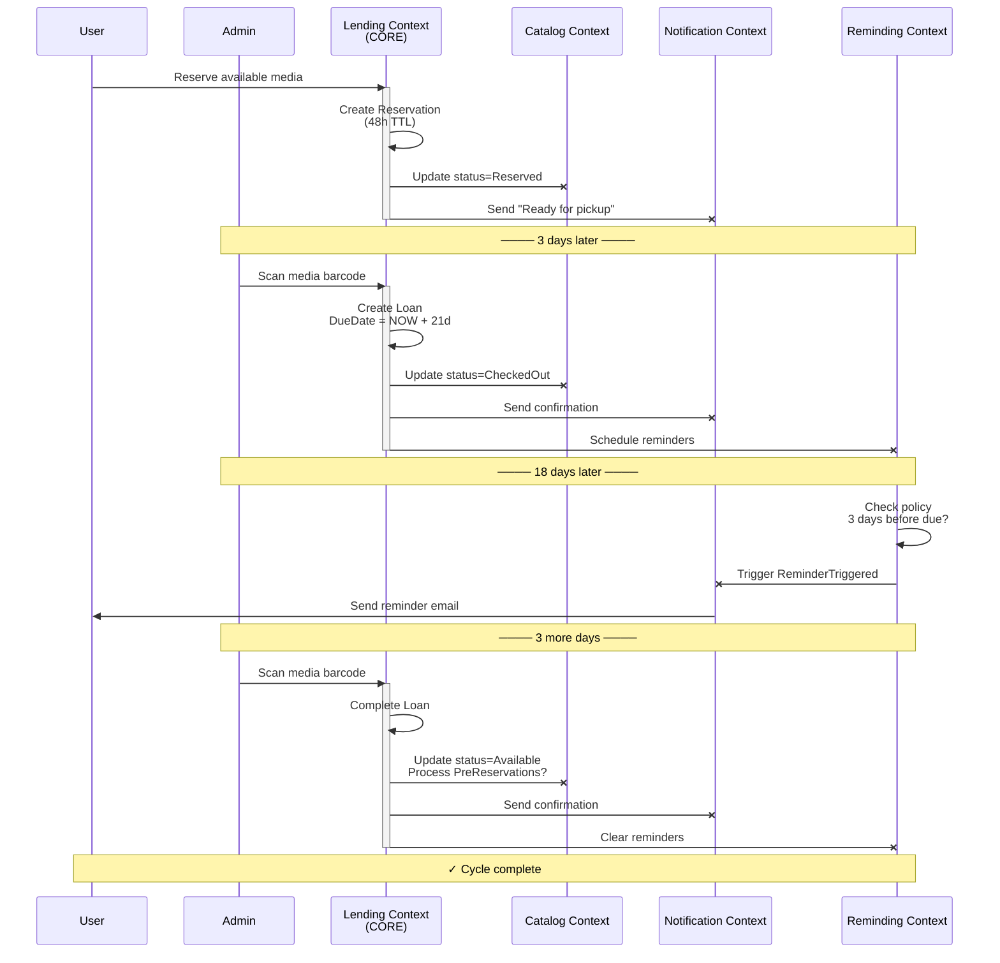
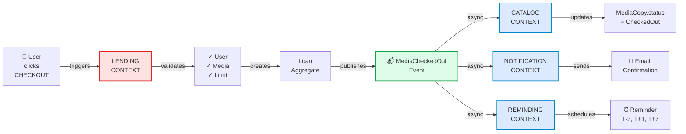
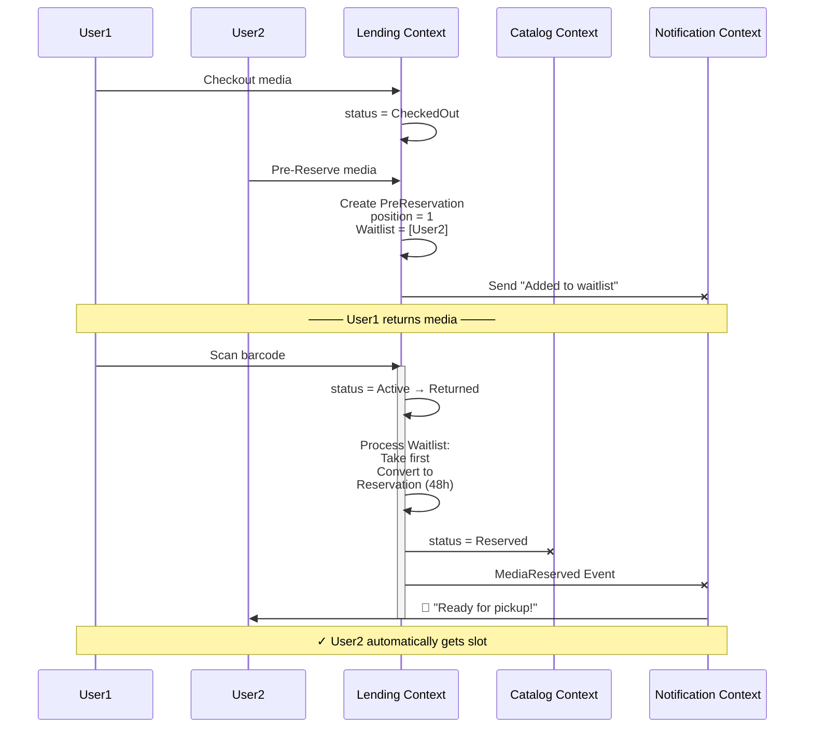
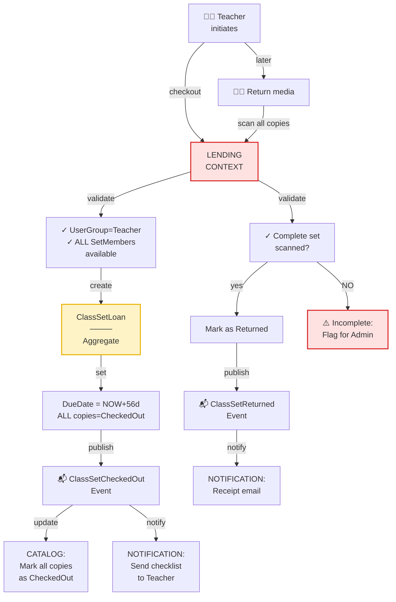
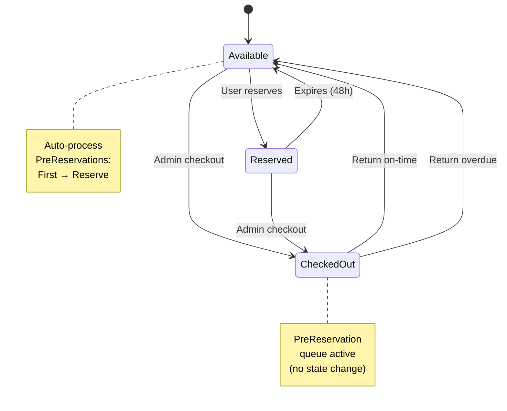
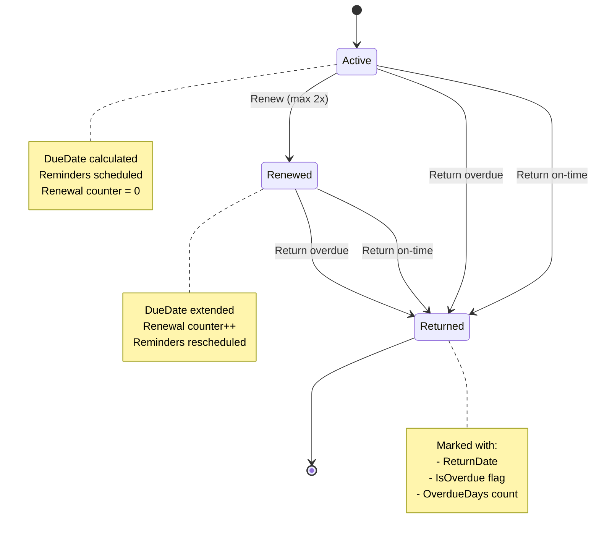
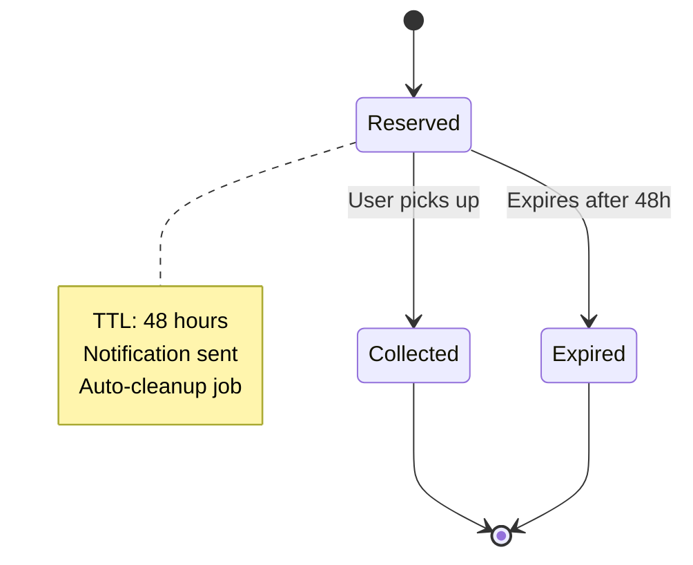
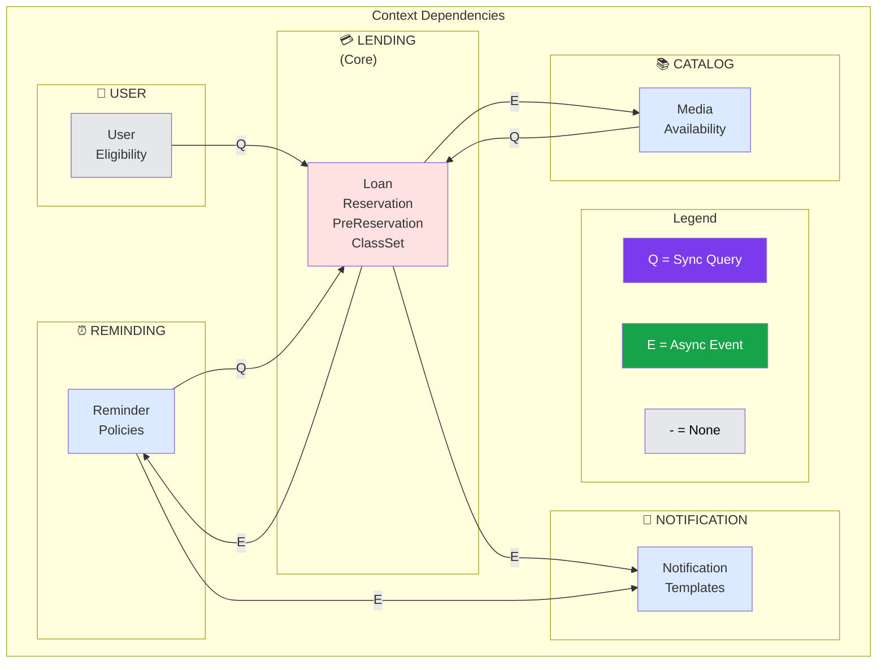
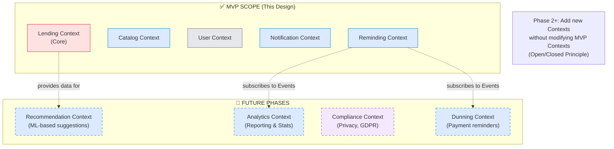

# Context Map Visualisierungen - Digital School Library

**Version:** 1.0  
**Format:** Mermaid Diagrams  
**Verwendung:** Druckbar, HTML-Export, Wiki-Integration

---

## 📊 Diagramm 1: Bounded Contexts Übersicht



---

## 📊 Diagramm 2: Integration Flows (Detailed)



---

## 📊 Diagramm 3: Domain Events Chain



---

## 📊 Diagramm 4: Waitlist / PreReservation Resolution



---

## 📊 Diagramm 5: Klassensatz Special Handling



---

## 📊 Diagramm 6: State Machines

### MediaCopy Availability State Machine



### Loan State Machine



### Reservation State Machine



---

## 📊 Diagramm 7: Context Dependency Matrix



---

## 📊 Diagramm 8: MVP Scope vs. Future



---

## 🎨 Legende

```
┌─────────────────────────────────────────────────────────────┐
│                    FARB-CODIERUNG                           │
├─────────────────────────────────────────────────────────────┤
│                                                              │
│  🔴 ROT (#fee2e2)      = CORE DOMAIN                        │
│     ├─ Höchste Komplexität                                 │
│     ├─ Beste Ressourcen                                    │
│     ├─ Detailliertes Testen                                │
│     └─ Zentraler Punkt aller Integrationen                 │
│                                                              │
│  🔵 BLAU (#dbeafe)     = SUPPORTING SUBDOMAIN               │
│     ├─ Mittlere Komplexität                                │
│     ├─ Unterstützen Core Domain                            │
│     ├─ Teilweise Standard-Lösungen                         │
│     └─ Mehrere Contexts möglich                            │
│                                                              │
│  ⚫ GRAU (#e5e7eb)     = GENERIC SUBDOMAIN                   │
│     ├─ Niedrige Komplexität                                │
│     ├─ Standard-Probleme                                   │
│     ├─ Kaufen statt Bauen möglich                          │
│     └─ Externe Dependencies                                │
│                                                              │
│  🟡 GELB               = SPECIAL HANDLING                    │
│     ├─ ClassSet (spezialisierte Regel)                     │
│     ├─ Klassensatz-spezifische Logik                       │
│     └─ Part of Lending Context aber besondere Rules        │
│                                                              │
│  ──────────────────────────────────────────────────────────  │
│                                                              │
│  ⚡ BOLD ARROW        = Synchrone Query (Request-Reply)     │
│     ├─ Blocking                                            │
│     ├─ Real-time Response                                  │
│     └─ Must succeed for action                             │
│                                                              │
│  ─ ─ DASHED ARROW     = Asynchrone Event (Pub-Sub)         │
│     ├─ Non-blocking                                        │
│     ├─ Fire-and-forget                                     │
│     ├─ Eventual consistency                                │
│     └─ Handler can fail independently                      │
│                                                              │
└─────────────────────────────────────────────────────────────┘
```

---

## 📐 Verwendung dieser Diagramme

### For Documentation:
- Kopieren Sie die Mermaid-Code-Blöcke in Markdown
- Verwenden Sie in README, Wiki, oder Docs

### For Presentation:
- Nutzen Sie Mermaid Live Editor (mermaid.live)
- Export als SVG/PNG für Slides

### For Code Comments:
```java
// Flow documented in: docs/architecture/context-map-visualizations.md
// Diagram 1: Bounded Contexts Overview
// Diagram 3: Domain Events Chain
public void checkout(User user, Media media) {
  // ...
}
```

