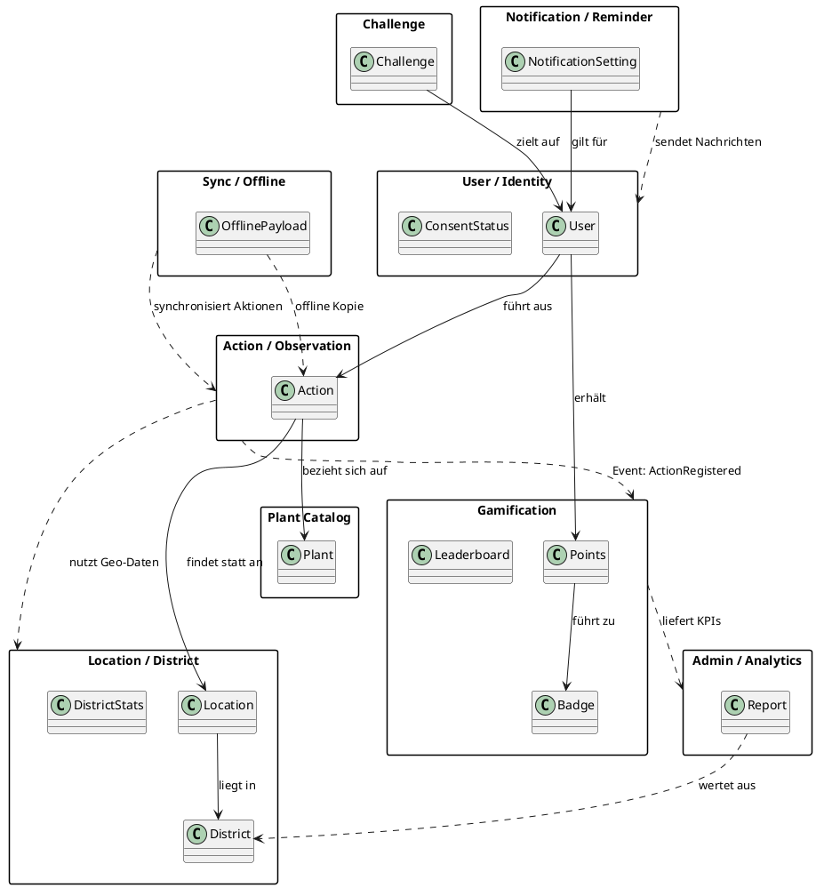
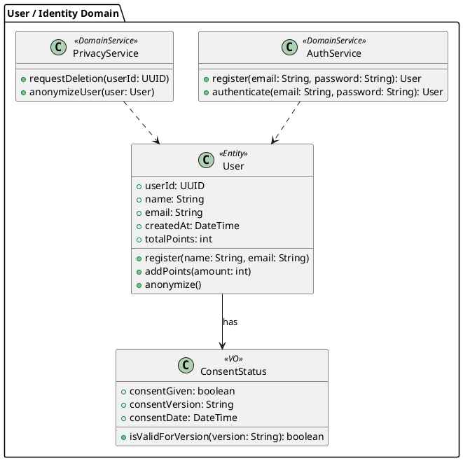
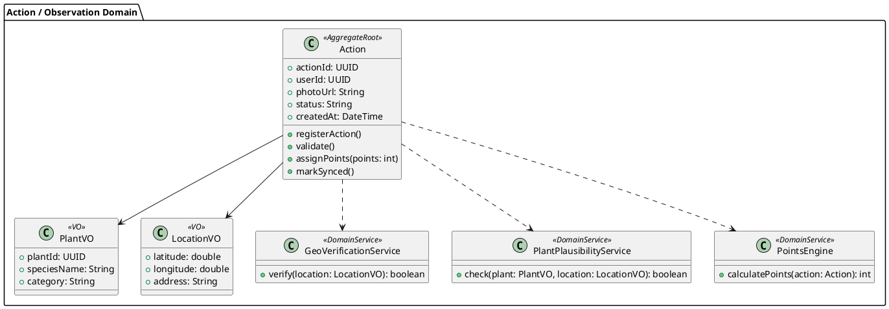
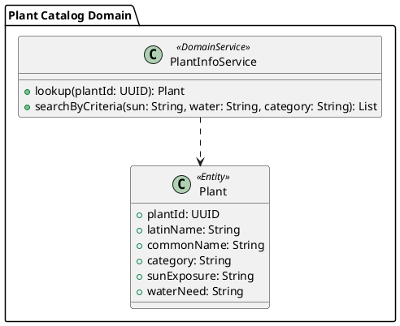
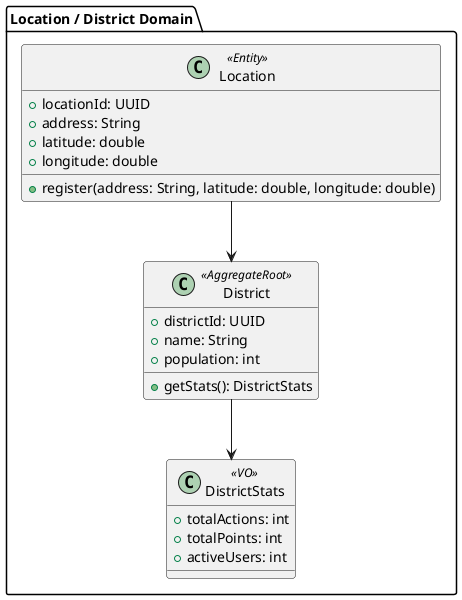
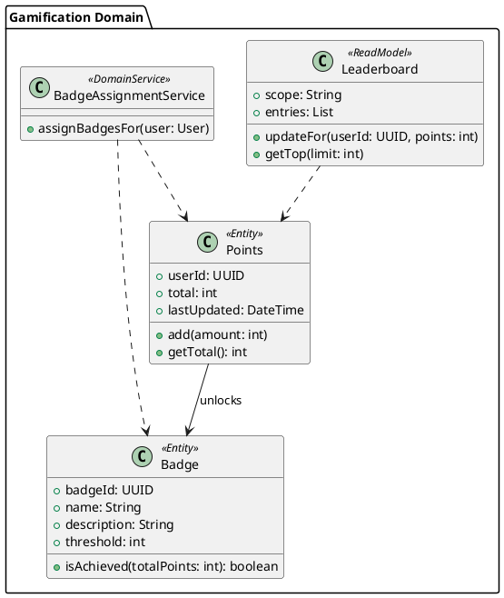
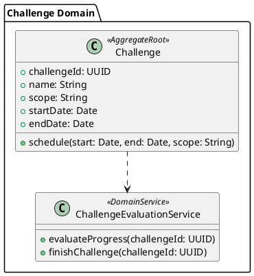
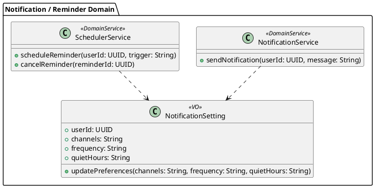
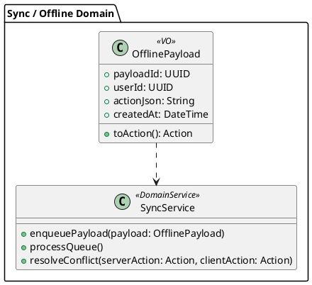

# UrbanBloom — UML Domain Model (PlantUML)

## 1) Gesamtmodell mit Domaingrenzen und Kommunikation

## 2) User / Identity Domain

## 3) Action / Observation Domain

## 4) Plant Catalog Domain

## 5) Location / District Domain

## 6) Gamification Domain

## 7) Challenge Domain

## 8) Notification / Reminder Domain

## 9) Sync / Offline Domain

