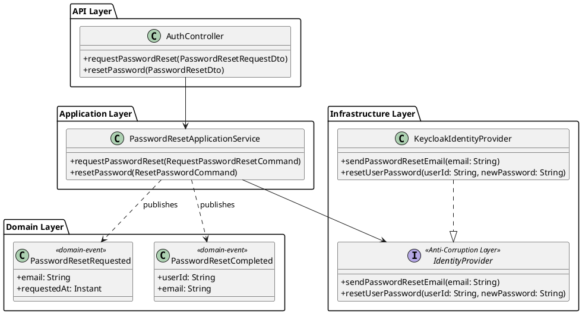
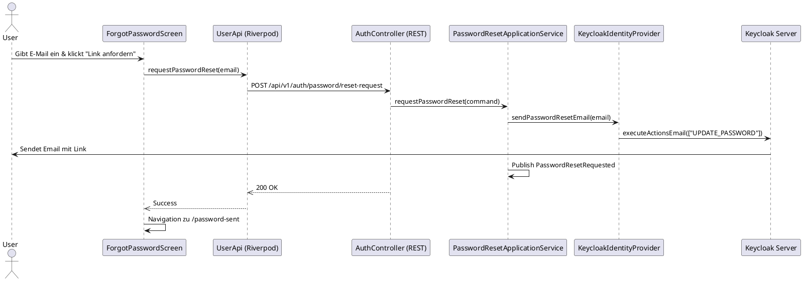
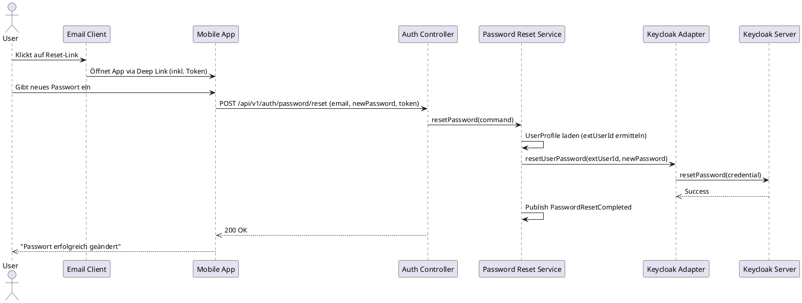

# Implementierungs-Dokumentation: [STORY] Passwort zurücksetzen

## 📋 Übersicht
- **User Story / Feature ID:** US-25 (Sub-Issue von #22)
- **Datum:** 2026-01-14
- **Status:** Abgeschlossen
- **Verantwortlich:** Antigravity (AI Assistant)

## 1. 🎯 Kontext & Ziele
Benutzer der Digitalen Schulbibliothek müssen in der Lage sein, ihr Passwort sicher zurückzusetzen. Die Implementierung umfasst eine End-to-End Lösung vom Mobile-Frontend über das Spring Boot Backend bis hin zur Keycloak-Integration.

- **Ziel:** Bereitstellung einer benutzerfreundlichen Oberfläche zur Password-Reset-Anforderung und die technische Umsetzung mittels Keycloak Admin API.
- **Referenz:** [Issue #25](https://github.com/ukondert/pr_digital-school-library/issues/25)

## 2. 🏗️ Architektur-Überblick
Die Lösung folgt der **Hexagonalen Architektur** im Backend und dem **Feature-First Pattern** im Flutter-Frontend.

### Komponenten & Layer
- **Frontend (Flutter):**
  - Feature: `user`
  - Pattern: MVVM mit Riverpod für State-Management.
  - Routing: GoRouter für Navigation zwischen Login, Request-Form und Success-Page.
- **Backend (Spring Boot):**
  - Modul: `module-user`
  - Pattern: Domain-Driven Design (DDD) mit klarer Trennung in API, Application, Domain und Infrastructure Layer.
- **Identity Provider (Keycloak):**
  - Verantwortlich für Token-Management, E-Mail-Versand und Passwort-Speicherung.

## 3. 🧩 Detailliertes Design & Klassen-Struktur

### Backend Struktur
Das Backend nutzt den `IdentityProvider`-Port, um Keycloak-spezifische Implementierungen zu kapseln (Anti-Corruption Layer).

### Frontend Struktur
Das Flutter-Frontend verwendet Riverpod-Provider für die API-Kommunikation und GoRouter für den Screen-Flow.

- **Routes:**
  - `/forgot-password`: [ForgotPasswordScreen](../../frontend-mobile/lib/features/user/presentation/pages/forgot_password_screen.dart)
  - `/password-sent`: [PasswordSentScreen](../../frontend-mobile/lib/features/user/presentation/pages/password_sent_screen.dart)
- **State & Data:**
  - API Service: `userApiProvider` (Riverpod)
  - DTOs: `PasswordResetRequestDTO`

## 🎬 4. Kommunikationsabläufe

### Sequenzdiagramm: Passwort-Reset anfordern

### Sequenzdiagramm: Passwort zurücksetzen (Abschluss)

**Erläuterung:**
- **Deep Linking:** Der Klick in der E-Mail wird vom Betriebssystem erkannt und an die App weitergeleitet. Das Token aus der URL wird extrahiert.
- **Sicherheit:** Das Token wird von Keycloak validiert (im Rahmen des Passwort-Resets). Das Backend ermittelt über das `UserProfile` die interne Keycloak-ID.
## 🗄️ 5. Datenmodell
In der lokalen PostgreSQL-Datenbank werden keine Reset-Informationen persistent gespeichert. Das System verlässt sich vollständig auf die Keycloak-Infrastruktur.

- **Domain Events:**
    - `PasswordResetRequested`: Audit-Log für die Anforderung.
    - `PasswordResetCompleted`: Audit-Log für den erfolgreichen Abschluss.

## 💻 6. Implementierungs-Details

### Frontend (Mobile)
- **Komponenten:**
  - `PasswordResetForm`: Validiert die E-Mail-Adresse (Format-Check) und steuert den Ladezustand des Buttons.
  - `PasswordResetSuccessCard`: Zeigt eine Bestätigung an und bietet einen Button zurück zum Login.
- **Deep Linking:** Die App ist so konfiguriert (via AndroidManifest/Entitlements), dass sie Keycloak-Reset-Links erkennt und den Benutzer direkt zur Passwort-Eingabe führt.

### Backend (Infrastructure)
- **Keycloak Admin Client:** Nutzt `keycloak-admin-client` Bibliothek für die Kommunikation.
- **Security:** CSRF ist für die öffentlichen Reset-Endpunkte deaktiviert.

### Wichtige Dateien:
- **Frontend:**
    - [forgot_password_screen.dart](../../frontend-mobile/lib/features/user/presentation/pages/forgot_password_screen.dart)
    - [password_reset_form.dart](../../frontend-mobile/lib/design_system/components/molecules/password_reset_form.dart)
- **Backend:**
    - [AuthController.java](../../backend/module-user/src/main/java/com/schoollibrary/user/api/AuthController.java)
    - [KeycloakIdentityProvider.java](../../backend/module-user/src/main/java/com/schoollibrary/user/adapter/infrastructure/keycloak/KeycloakIdentityProvider.java)

## ✅ 7. Verifizierung & Tests
- **Automatisierte Tests:**
    - Unit Tests (Backend): `PasswordResetApplicationServiceTest`
    - Widget Tests (Frontend): Geplant für den nächsten Sprint.
- **Manuelle Verifizierung:**
    - Vollständiger Flow vom Login-Screen über E-Mail-Eingabe bis zum Empfang der E-Mail (verifiziert via Mailhog).

## 🔗 8. Referenzen
- [API-Spec (OpenAPI)](../api/user.yaml)
- [Keycloak Configuration](../configurations/keycloak-setup.md)
