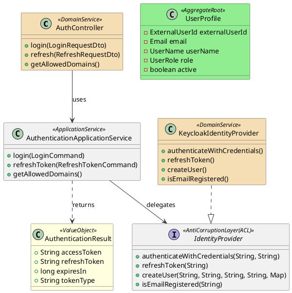
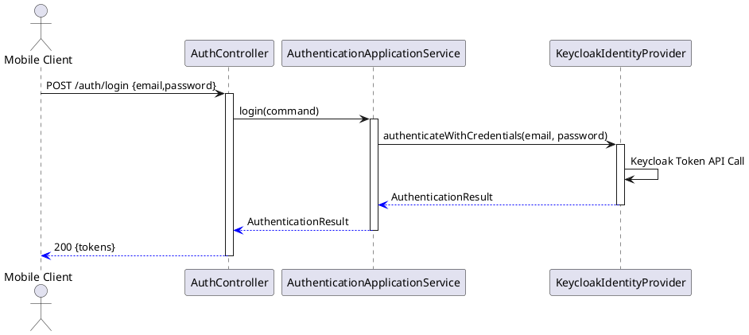
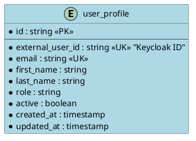

# Implementierungsdokument — US-USR-01-REF: User Authentication

Sprache: Deutsch

Kurzüberblick
- Story: `US-USR-01-REF_user-authentication` (siehe zugehörige Requirements)
- Ziel: Sichere Anmeldung / Registrierung via Keycloak (OIDC/OAuth2) für Mobile + Web Admin (MVP)

Relevante Referenzen
- User Story: [US-USR-01-REF_user-authentication](../requirements/user-stories/refined/US-USR-01-REF_user-authentication.md)
- Architektur-Übersicht: [docs/architecture/README.md](../architecture/README.md)
- Prompt / Template: [.github/prompts/generate-implementation-doc.prompt.md](../../.github/prompts/generate-implementation-doc.prompt.md)

Kontext & Annahmen
- Keycloak läuft lokal in Dev (Port 8081) — siehe Story.
- Backend: Spring Boot (modular monolith) unter `backend/`.
- Mobile: Flutter App unter `frontend-mobile/`.
- Web Admin: React/TS unter `frontend-web/`.
- Diese Dokumentation fasst die umgesetzte Auth-Architektur und erforderliche Code-Pfade zusammen; Pfade sollten bei Bedarf an die tatsächliche Projektstruktur angepasst werden.

Architektur-Übersicht (Kurz)
- Pattern: Anti-Corruption Layer (IdentityProvider Adapter), Strategy/Adapter für Keycloak, OAuth2 Resource Server in Spring Security, Repository für `UserProfile` in App-DB.
- Layer: UI -> Controller (`AuthController`) -> Service (`AuthenticationApplicationService`) -> Adapter (`IdentityProvider` / `KeycloakIdentityProvider`) -> Keycloak
- Persistenz: `UserProfile` (App-DB) speichert `external_user_id` (Keycloak user id) + Rollen-Mapping.

Wesentliche Komponenten (Ubiquitous Language)
- `IdentityProvider` (Interface): Kapselt IdP-Operationen (`createUser`, `authenticateWithCredentials`, `refreshToken`, `isEmailRegistered`)
- `KeycloakIdentityProvider` (Adapter): konkrete Implementierung gegen Keycloak Admin/Token-Endpoints
- `AuthController`: REST-Endpunkte `/api/v1/auth/login`, `/api/v1/auth/refresh`, `/api/v1/auth/allowed-domains`
- `AuthenticationApplicationService`: Applikationslogik für Login, Token-Handling und Konfigurations-Abfragen
- `UserProfile` (Aggregate): `externalUserId`, `email`, `userName`, `role`, `active`

### Klassendiagramm

### Sequenzdiagramm (Login)

### ER-Diagramm (App-DB)

Technische Details / Implementierungspunkte

- Security (Backend)
  - Spring Security konfiguriert als OAuth2 Resource Server (JWT validation) mit `issuer-uri` / JWK-Set.
  - `JwtAuthenticationConverter` mapping für Keycloak-Rollen → Spring Authorities.
  - Empfohlene Datei (Prüfen/Anpassen): [backend/schoollibrary-app/src/main/java/com/schoollibrary/app/config/SecurityConfig.java](../../backend/schoollibrary-app/src/main/java/com/schoollibrary/app/config/SecurityConfig.java)

- IdentityProvider Adapter
  - Interface: [backend/module-user/src/main/java/com/schoollibrary/user/domain/IdentityProvider.java](../../backend/module-user/src/main/java/com/schoollibrary/user/domain/IdentityProvider.java)
  - Keycloak Adapter: [backend/module-user/src/main/java/com/schoollibrary/user/adapter/infrastructure/keycloak/KeycloakIdentityProvider.java](../../backend/module-user/src/main/java/com/schoollibrary/user/adapter/infrastructure/keycloak/KeycloakIdentityProvider.java)
  - Adapter kapselt Token-Endpoint-Aufrufe, User-Provisioning (Admin API) und Token-Refresh.

- REST API Endpoints
  - `POST /api/v1/auth/login` → handled in `AuthController`
  - `POST /api/v1/auth/refresh` → handled in `AuthController`
  - `GET /api/v1/auth/allowed-domains` → handled in `AuthController`
  - `POST /api/v1/registration` → `RegistrationController.register()` → `UserRegistrationService.registerUser()`
  - Beispiel-Pfade (zu prüfen):
    - [backend/module-user/src/main/java/com/schoollibrary/user/api/RegistrationController.java](../../backend/module-user/src/main/java/com/schoollibrary/user/api/RegistrationController.java)
    - [backend/module-user/src/main/java/com/schoollibrary/user/application/UserRegistrationService.java](../../backend/module-user/src/main/java/com/schoollibrary/user/application/UserRegistrationService.java)

- Datenmodell
  - `UserProfile` Spezifikation: speichert `external_user_id` (Keycloak user id), `email`, `role`, `active`.
  - Repository: [backend/module-user/src/main/java/com/schoollibrary/user/domain/UserProfileRepository.java](../../backend/module-user/src/main/java/com/schoollibrary/user/domain/UserProfileRepository.java)

- Frontend (Web Admin)
  - Login-Flow: `frontend-web/src/services/api.service.ts` verwendet `POST /api/v1/auth/login`.
  - Token-Storage: `localStorage`/`sessionStorage`; Axios-Interceptor für Authorization-Header.
  - Empfohlene Dateien:
    - [frontend-web/src/services/api.service.ts](../../frontend-web/src/services/api.service.ts)

- Frontend (Mobile)
  - Flutter Dio Client: `frontend-mobile/lib/core/network/api_client.dart`.
  - Secure Storage: `flutter_secure_storage` für Tokens.
  - Empfohlene Dateien:
    - [frontend-mobile/lib/core/network/api_client.dart](../../frontend-mobile/lib/core/network/api_client.dart)
    - [frontend-mobile/lib/core/di/providers.dart](../../frontend-mobile/lib/core/di/providers.dart)

Deployment & Laufzeit
-- Env-Config: `${KEYCLOAK_ISSUER_URI}` und `${KEYCLOAK_JWK_SET_URI}` in `application.properties`.
  - Datei: [backend/schoollibrary-app/src/main/resources/application.properties](../../backend/schoollibrary-app/src/main/resources/application.properties)
  - Keycloak Realm: `schoollibrary` mit Clients `schoollibrary-web` (PKCE) und `schoollibrary-mobile` (PKCE).

Tests
- Unit: `SecurityConfig` converter mapping, `AuthenticationApplicationService` business logic.
- Integration: login/refresh against a Keycloak test instance (Testcontainer or lokal Keycloak).
- E2E: Mobile login flow using emulator + local backend.

Offene Punkte / ToDos (Prüfen im Repo)
- Verifiziere existierende Pfade für `SecurityConfig`, `AuthController`, `AuthenticationApplicationService`, `IdentityProvider`.
- Implementiere fehlende Adapter/Mocks für Tests (Keycloak Testcontainer).
- Sicherstellen: `spring.security.oauth2.resourceserver.jwt.issuer-uri` ist gesetzt.

Vorschlag Ablage
- Datei: `docs/implementation-details/US-USR-01-REF_user-authentication-implementation.md` (diese Datei)

Nächste Schritte
- Review: Bitte prüfe die in Abschnitt "Technische Details" genannten Pfade und gib Bescheid, falls Pfade abweichen.
- Ich kann anschließend die Markdown-Datei mit exakten relativen Code-Links aktualisieren, sobald Du die realen Dateipfade bestätigst.

