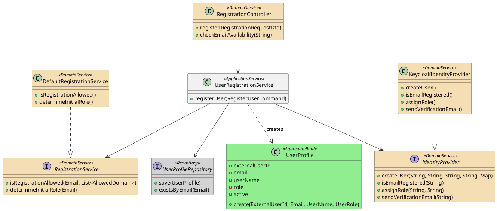
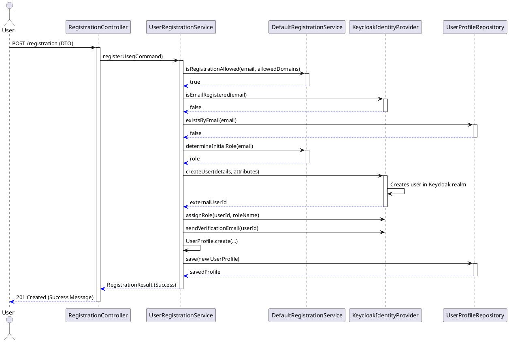
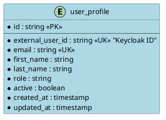

# Implementierungs-Dokumentation: US-USR-02-REF: Self-Registration

## 📋 Übersicht
- **User Story / Feature ID:** US-USR-02-REF
- **Datum:** 2026-01-12
- **Status:** Abgeschlossen
- **Verantwortlich:** Backend Team / Senior Architect

## 1. 🎯 Kontext & Ziele
Prospective students and teachers need to be able to register accounts using their school email addresses to access the school library system.
- **Ziel:** Secure self-registration flow with domestic validation and email verification via Keycloak.
- **Referenz:** [US-USR-02-REF: Self-Registration (Refined)](file:///e:/SW-Dev\Git\ukondert\_school-projects\pr_digital-school-library\docs\requirements\user-stories\refined\US-USR-02-REF_self-registration.md)

## 2. 🏗️ Architektur-Überblick
Die Implementierung erfolgt im **User Context (Generic Subdomain)** innerhalb des `module-user`.
- **Architektur:** Hexagonale Architektur / Layered DDD (API -> Application -> Domain -> Infrastructure).
- **Betroffene Komponenten:**
    - **Backend:** `module-user` (API, Domain Logic, Keycloak Adapter).
    - **Infrastructure:** Keycloak (IAM) as the Identity Provider.

## 3. 🧩 Detailliertes Design & Klassen-Struktur
The design uses the **Adapter Pattern** for IdP abstraction and a **Domain Service** for business rule validation.

### Klassendiagramm

**Erläuterung:**
- **UserRegistrationService:** Orchestriert den Registrierungsprozess (Validierung, IdP-Aktion, Persistierung).
- **RegistrationService:** Beinhaltet reine Domänenlogik (z.B. Domain-Check, Rollen-Logik).
- **KeycloakIdentityProvider:** Adapter, der die Keycloak Admin API anspricht und gegen das domäneninterne Interface kapselt.
- **UserProfile:** Aggregate Root für das lokale Benutzerprofil.

## 🎬 4. Kommunikationsabläufe
Der Fluss startet bei der öffentlichen REST-API und endet mit einer E-Mail-Verifikation in Keycloak.

### Sequenzdiagramm

## 🗄️ 5. Datenmodell (Optional)
Ein lokales `UserProfile` wird erstellt, um die Brücke zwischen IdP-Identität und domänenspezifischen Daten (z.B. Ausleihen) zu schlagen.

### ER-Diagramm

## 💻 6. Implementierungs-Details
- **Design Patterns:** 
    - **Anti-Corruption Layer (ACL):** Der `KeycloakIdentityProvider` kapselt die Komplexität der Keycloak Admin API.
    - **Domain Service:** `RegistrationService` validiert Geschäftsregeln unabhängig von Infrastruktur.
    - **Factory Method:** `UserProfile.create(...)` stellt Invarianten bei der Erstellung sicher.
- **Besondere Herausforderungen:** Integration der Keycloak Admin Java Client Bibliothek und das Mapping von custom attributes (`studentId`, `schoolClass`).
- **Wichtige Code-Stellen:**
    - [UserRegistrationService.java](file:///e:/SW-Dev/Git/ukondert/_school-projects/pr_digital-school-library/backend/module-user/src/main/java/com/schoollibrary/user/application/UserRegistrationService.java#L39)
    - [KeycloakIdentityProvider.java](file:///e:/SW-Dev/Git/ukondert/_school-projects/pr_digital-school-library/backend/module-user/src/main/java/com/schoollibrary/user/adapter/infrastructure/keycloak/KeycloakIdentityProvider.java#L55)
    - [UserProfile.java](file:///e:/SW-Dev/Git/ukondert/_school-projects/pr_digital-school-library/backend/module-user/src/main/java/com/schoollibrary/user/domain/UserProfile.java#L46)

## ✅ 7. Verifizierung & Tests
- **Automatisierte Tests:**
    - Unit Tests: `UserRegistrationServiceTest`, `DefaultRegistrationServiceTest`
    - Integration Tests: `UserRegistrationIntegrationTest` (nutzt Testcontainers mit Keycloak)
- **Manuelle Tests:**
    - [ ] Registrierung mit `@gmail.com` (sollte fehlschlagen)
    - [ ] Registrierung mit `@schule.de` (Erfolg + E-Mail Trigger)
    - [ ] Login Versuch vor E-Mail Bestätigung (sollte fehlschlagen)

## 🔗 8. Referenzen
- [Keycloak Documentation](https://www.keycloak.org/documentation)
- [Architecture Index](file:///e:/SW-Dev/Git/ukondert/_school-projects/pr_digital-school-library/docs/architecture/README.md)
