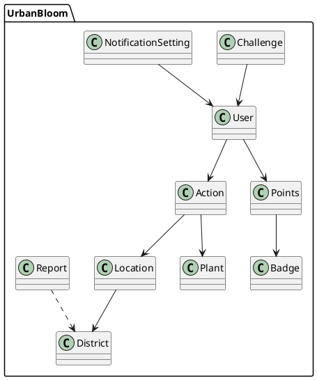
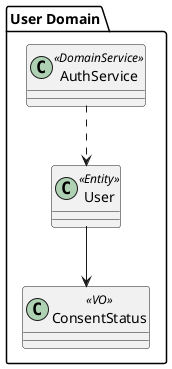
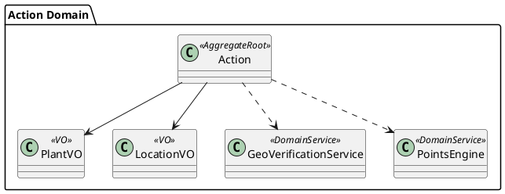
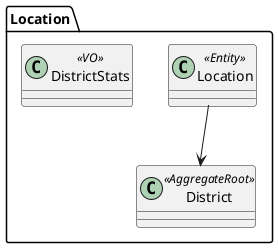
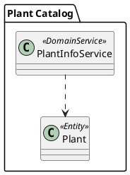
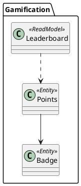
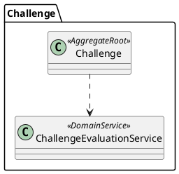
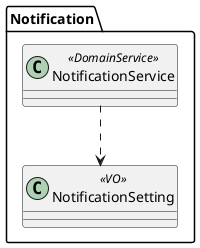
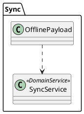

# UrbanBloom — UML Domain Model (PlantUML)

## 1) Gesamtmodell (ohne Attribute)

## 2) User Domain

## 3) Action Domain

## 4) Location Domain

## 5) Plant Domain

## 6) Gamification Domain

## 7) Challenge Domain

## 8) Notification Domain

## 9) Sync Domain

