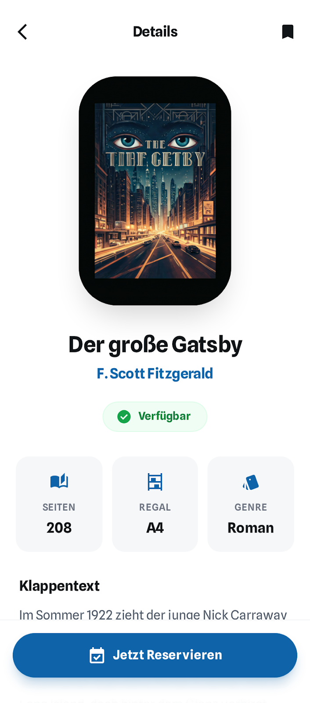

# User Story US-CAT-03-REF: Book Details View (Refined)

## Story
**As a** student  
**I want to** view detailed information about a specific book  
**So that** I can decide if I want to borrow it

## Priority
**Must-Have** | MVP Phase 2

## UI-Prototyp (Mobile)

- HTML: [buch_detailansicht_&_reservierung](../../../ui/prototypes/stitch_schulbibliotheks_app/buch_detailansicht_&_reservierung/code.html)
- Bild:



## Refinement Discussion

### Klärungspunkte & Entscheidungen

| Punkt | Entscheidung | Begründung |
|-------|--------------|------------|
| Welche Details sollen angezeigt werden? | Titel, Autor, ISBN, Cover, Beschreibung, Kategorie, Verlag, Jahr, Seitenzahl, Verfügbarkeit, Verfügbare/Gesamt Exemplare | Vollständige Buchinfos für fundierte Entscheidung |
| Soll es Bewertungen geben? | Nein im MVP | Could-Have für spätere Version |
| Ähnliche Bücher anzeigen? | Nein im MVP | Could-Have (basierend auf Kategorie/Autor) |
| Verfügbarkeitshistorie? | Nein im MVP | Could-Have für Statistiken |
| Direkt von Details ausleihen? | Ja, "Borrow"-Button wenn verfügbar | Reduziert Klicks für Benutzer |
| QR-Code für physisches Buch? | Nein im MVP | Could-Have für Bibliotheks-Integration |
| Buchstandort in Bibliothek? | Ja, wenn vorhanden (z.B. "Regal A3") | Hilft beim physischen Finden |

### Tasks

#### Backend
- Book-Detail-DTO mit allen Feldern erstellen
- API-Endpoint GET /api/v1/books/{id}
- 404-Handling für nicht existierende Bücher
- Verfügbarkeitsstatus mit Details (wann verfügbar)
- Exemplar-Informationen (BookCopy-Entität)
- Standort-Information einbinden
- OpenAPI-Dokumentation erweitern

#### Frontend Web (Web Admin App – nicht zutreffend)
- Diese Story ist ein User-Flow (Schüler/Lehrkraft) und wird in der Mobile App umgesetzt; die Web Admin App bietet hierfür keine UI.

#### Frontend Mobile
- BookDetailScreen erstellen
- ScrollView mit allen Buchinformationen
- Hero-Animation für Cover (von Liste zu Detail)
- Verfügbarkeits-Chip
- Floating-Action-Button für "Borrow"
- Share-Functionality (native Share-API)
- Back-Navigation
- Loading-Indicator
- Error-State mit Retry

#### Testing
- Unit-Tests für BookDetailService
- API-Integration-Tests für GET /api/v1/books/{id}
- Frontend-Component-Tests
- E2E-Test: Von Katalog zu Detail zu Ausleihe
- 404-Error-Handling-Tests
- Deep-Link-Tests (Mobile)

## Akzeptanzkriterien

### Functional
- [ ] Benutzer kann von Katalog/Suche auf Buchdetails klicken
- [ ] Header zeigt den Titel "Details" und eine Zurück-Navigation
- [ ] Detail-Seite zeigt alle Buchinformationen
- [ ] Cover-Bild wird prominent angezeigt
- [ ] Es gibt eine Bookmark/Favorit-Action (Icon)
- [ ] Verfügbarkeitsstatus ist klar erkennbar
- [ ] Anzahl verfügbarer Exemplare wird angezeigt
- [ ] Bei Verfügbarkeit: Button "Jetzt Reservieren" ist sichtbar und aktiv
- [ ] Bei Nichtverfügbarkeit: Info wann voraussichtlich verfügbar
- [ ] Standort in Bibliothek wird angezeigt (falls vorhanden)
- [ ] Zurück-Navigation funktioniert
- [ ] Fehlermeldung bei nicht existierendem Buch

### Non-Functional
- [ ] Ladezeit < 1 Sekunde
- [ ] API-Response-Time < 300ms
- [ ] Cover-Bild hochauflösend (bis 1MB)
- [ ] Mobile: Hero-Animation smooth (60fps)
- [ ] Deep-Links funktionieren (Mobile)
- [ ] Barrierefrei: Screen-Reader-kompatibel

### Technical
- [ ] REST-Endpoint: GET /api/v1/books/{id}
- [ ] Response: BookDetailDTO mit allen Feldern
- [ ] HTTP-Status: 200 (OK), 404 (Not Found), 401 (Unauthorized)
- [ ] Cover-URL als absolute URL
- [ ] Verfügbarkeit berechnet aus BookCopy-Relation
- [ ] OpenAPI-Schema vollständig dokumentiert
- [ ] JWT-Token erforderlich

## Technische Notizen

### Backend-Architektur
**Technologie**: Spring Boot, Spring Data JPA, PostgreSQL

**BookCopy Entity** (für Exemplar-Tracking):
```java
@Entity
@Table(name = "book_copies")
public class BookCopy {
    @Id
    @GeneratedValue(strategy = GenerationType.IDENTITY)
    private Long id;
    
    @ManyToOne(fetch = FetchType.LAZY)
    @JoinColumn(name = "book_id", nullable = false)
    private Book book;
    
    @Column(unique = true, nullable = false)
    private String copyNumber; // z.B. "001", "002"
    
    @Column(nullable = false)
    private String location; // z.B. "Regal A3"
    
    @Enumerated(EnumType.STRING)
    private CopyStatus status; // AVAILABLE, BORROWED, MAINTENANCE, LOST
    
    @OneToOne(mappedBy = "bookCopy")
    private Borrowing currentBorrowing; // null wenn verfügbar
}
```

**BookDetailDTO**:
```java
@Data
@Builder
public class BookDetailDTO {
    private Long id;
    private String title;
    private String author;
    private String isbn;
    private String coverUrl;
    private String description;
    private BookCategory category;
    private String publisher;
    private Integer publicationYear;
    private Integer pages;
    private String language;
    
    // Availability info
    private boolean available;
    private Integer totalCopies;
    private Integer availableCopies;
    private List<CopyInfo> copies;
    
    // Calculated fields
    private LocalDate nextAvailableDate; // Wenn alle ausgeliehen
}

@Data
@Builder
public class CopyInfo {
    private Long copyId;
    private String copyNumber;
    private String location;
    private CopyStatus status;
    private LocalDate availableFrom; // Bei BORROWED
}
```

**BookService Enhancement**:
```java
@Service
public class BookService {
    
    public BookDetailDTO getBookDetails(Long bookId) {
        Book book = bookRepository.findById(bookId)
            .orElseThrow(() -> new BookNotFoundException(bookId));
        
        List<BookCopy> copies = bookCopyRepository.findByBookId(bookId);
        
        return BookDetailDTO.builder()
            .id(book.getId())
            .title(book.getTitle())
            .author(book.getAuthor())
            .isbn(book.getIsbn())
            .coverUrl(book.getCoverUrl())
            .description(book.getDescription())
            .category(book.getCategory())
            .publisher(book.getPublisher())
            .publicationYear(book.getPublicationYear())
            .pages(book.getPages())
            .language(book.getLanguage())
            .available(copies.stream().anyMatch(c -> c.getStatus() == CopyStatus.AVAILABLE))
            .totalCopies(copies.size())
            .availableCopies((int) copies.stream().filter(c -> c.getStatus() == CopyStatus.AVAILABLE).count())
            .copies(copies.stream().map(this::toCopyInfo).toList())
            .nextAvailableDate(calculateNextAvailableDate(copies))
            .build();
    }
    
    private LocalDate calculateNextAvailableDate(List<BookCopy> copies) {
        return copies.stream()
            .filter(c -> c.getStatus() == CopyStatus.BORROWED)
            .map(c -> c.getCurrentBorrowing().getDueDate())
            .min(LocalDate::compareTo)
            .orElse(null);
    }
}
```

**API Controller**:
```java
@RestController
@RequestMapping("/api/v1/books")
public class BookController {
    
    @GetMapping("/{id}")
    public ResponseEntity<BookDetailDTO> getBookDetails(@PathVariable Long id) {
        BookDetailDTO details = bookService.getBookDetails(id);
        return ResponseEntity.ok(details);
    }
}
```

**Response Beispiel**:
```json
{
  "id": 1,
  "title": "Der Hobbit",
  "author": "J.R.R. Tolkien",
  "isbn": "978-3-12-345678-9",
  "coverUrl": "https://cdn.schoollibrary.com/covers/hobbit.jpg",
  "description": "Bilbo Beutlin, ein angesehener Hobbit, lebt zufrieden in seiner Höhle...",
  "category": "FANTASY",
  "publisher": "Klett-Cotta",
  "publicationYear": 1937,
  "pages": 336,
  "language": "DE",
  "available": true,
  "totalCopies": 3,
  "availableCopies": 2,
  "copies": [
    {
      "copyId": 1,
      "copyNumber": "001",
      "location": "Regal A3",
      "status": "AVAILABLE",
      "availableFrom": null
    },
    {
      "copyId": 2,
      "copyNumber": "002",
      "location": "Regal A3",
      "status": "BORROWED",
      "availableFrom": "2026-01-15"
    },
    {
      "copyId": 3,
      "copyNumber": "003",
      "location": "Regal A3",
      "status": "AVAILABLE",
      "availableFrom": null
    }
  ],
  "nextAvailableDate": "2026-01-15"
}
```

### Frontend-Architektur Web (Optional – kein Teil der Web Admin App)
_Hinweis: Die Web Admin App betrifft nur Admin-Stories. Diese Story ist ein Mobile-User-Flow._
**Technologie**: React, TypeScript, React Router

**BookDetail Component**:
```typescript
export const BookDetail: React.FC = () => {
  const { id } = useParams<{ id: string }>();
  const navigate = useNavigate();
  const [book, setBook] = useState<BookDetailDTO | null>(null);
  const [loading, setLoading] = useState(true);
  const [error, setError] = useState<string | null>(null);

  useEffect(() => {
    loadBookDetails();
  }, [id]);

  const loadBookDetails = async () => {
    setLoading(true);
    try {
      const response = await apiClient.get<BookDetailDTO>(`/api/v1/books/${id}`);
      setBook(response.data);
    } catch (err: any) {
      if (err.response?.status === 404) {
        setError('Book not found');
      } else {
        setError('Failed to load book details');
      }
    } finally {
      setLoading(false);
    }
  };

  const handleBorrow = () => {
    navigate(`/books/${id}/borrow`);
  };

  const handleShare = () => {
    navigator.clipboard.writeText(window.location.href);
    // Show toast notification
  };

  if (loading) return <BookDetailSkeleton />;
  if (error) return <ErrorState message={error} />;
  if (!book) return null;

  return (
    <Container maxWidth="lg">
      <Box sx={{ py: 4 }}>
        <Button startIcon={<ArrowBackIcon />} onClick={() => navigate(-1)}>
          Back to Catalog
        </Button>
        
        <Grid container spacing={4} sx={{ mt: 2 }}>
          <Grid item xs={12} md={4}>
            <Card>
              <CardMedia
                component="img"
                image={book.coverUrl}
                alt={book.title}
                sx={{ height: 500, objectFit: 'contain' }}
              />
            </Card>
          </Grid>
          
          <Grid item xs={12} md={8}>
            <Typography variant="h3" gutterBottom>{book.title}</Typography>
            <Typography variant="h6" color="text.secondary" gutterBottom>
              by {book.author}
            </Typography>
            
            <Chip 
              label={book.available ? 'Available' : 'Borrowed'} 
              color={book.available ? 'success' : 'error'}
              sx={{ my: 2 }}
            />
            
            <Typography variant="body1" paragraph>
              {book.description}
            </Typography>
            
            <Divider sx={{ my: 2 }} />
            
            <Grid container spacing={2}>
              <Grid item xs={6}>
                <Typography variant="body2" color="text.secondary">ISBN</Typography>
                <Typography variant="body1">{book.isbn}</Typography>
              </Grid>
              <Grid item xs={6}>
                <Typography variant="body2" color="text.secondary">Category</Typography>
                <Typography variant="body1">{book.category}</Typography>
              </Grid>
              <Grid item xs={6}>
                <Typography variant="body2" color="text.secondary">Publisher</Typography>
                <Typography variant="body1">{book.publisher}</Typography>
              </Grid>
              <Grid item xs={6}>
                <Typography variant="body2" color="text.secondary">Year</Typography>
                <Typography variant="body1">{book.publicationYear}</Typography>
              </Grid>
              <Grid item xs={6}>
                <Typography variant="body2" color="text.secondary">Pages</Typography>
                <Typography variant="body1">{book.pages}</Typography>
              </Grid>
              <Grid item xs={6}>
                <Typography variant="body2" color="text.secondary">Language</Typography>
                <Typography variant="body1">{book.language}</Typography>
              </Grid>
            </Grid>
            
            <Divider sx={{ my: 2 }} />
            
            <Typography variant="h6" gutterBottom>Availability</Typography>
            <Typography variant="body1" gutterBottom>
              {book.availableCopies} of {book.totalCopies} copies available
            </Typography>
            
            {book.copies.map(copy => (
              <Chip
                key={copy.copyId}
                label={`${copy.copyNumber} - ${copy.location} - ${copy.status}`}
                size="small"
                sx={{ mr: 1, mb: 1 }}
                color={copy.status === 'AVAILABLE' ? 'success' : 'default'}
              />
            ))}
            
            {!book.available && book.nextAvailableDate && (
              <Alert severity="info" sx={{ mt: 2 }}>
                Next available: {new Date(book.nextAvailableDate).toLocaleDateString()}
              </Alert>
            )}
            
            <Box sx={{ mt: 3 }}>
              <Button
                variant="contained"
                size="large"
                disabled={!book.available}
                onClick={handleBorrow}
                sx={{ mr: 2 }}
              >
                {book.available ? 'Borrow this Book' : 'Not Available'}
              </Button>
              
              <Button
                variant="outlined"
                startIcon={<ShareIcon />}
                onClick={handleShare}
              >
                Share
              </Button>
            </Box>
          </Grid>
        </Grid>
      </Box>
    </Container>
  );
};
```

### Frontend-Architektur Mobile
**Technologie**: Flutter/Dart

**BookDetailScreen**:
```dart
class BookDetailScreen extends StatefulWidget {
  final String bookId;
  
  const BookDetailScreen({required this.bookId});

  @override
  _BookDetailScreenState createState() => _BookDetailScreenState();
}

class _BookDetailScreenState extends State<BookDetailScreen> {
  BookDetail? _book;
  bool _isLoading = true;
  String? _error;

  @override
  void initState() {
    super.initState();
    _loadBookDetails();
  }

  Future<void> _loadBookDetails() async {
    setState(() => _isLoading = true);
    
    try {
      final response = await apiClient.get('/api/v1/books/${widget.bookId}');
      setState(() {
        _book = BookDetail.fromJson(response.data);
        _error = null;
      });
    } catch (e) {
      setState(() {
        _error = e is DioError && e.response?.statusCode == 404
          ? 'Book not found'
          : 'Failed to load book details';
      });
    } finally {
      setState(() => _isLoading = false);
    }
  }

  @override
  Widget build(BuildContext context) {
    return Scaffold(
      appBar: AppBar(
        title: Text(_book?.title ?? 'Book Details'),
        actions: [
          IconButton(
            icon: Icon(Icons.share),
            onPressed: _handleShare,
          ),
        ],
      ),
      body: _buildBody(),
      floatingActionButton: _book?.available == true
        ? FloatingActionButton.extended(
            onPressed: _handleBorrow,
            label: Text('Borrow'),
            icon: Icon(Icons.book),
          )
        : null,
    );
  }

  Widget _buildBody() {
    if (_isLoading) {
      return Center(child: CircularProgressIndicator());
    }
    
    if (_error != null) {
      return ErrorStateWidget(
        message: _error!,
        onRetry: _loadBookDetails,
      );
    }
    
    if (_book == null) return SizedBox();

    return SingleChildScrollView(
      child: Column(
        crossAxisAlignment: CrossAxisAlignment.start,
        children: [
          Hero(
            tag: 'book-${_book!.id}',
            child: CachedNetworkImage(
              imageUrl: _book!.coverUrl,
              height: 400,
              width: double.infinity,
              fit: BoxFit.contain,
              placeholder: (context, url) => Center(child: CircularProgressIndicator()),
              errorWidget: (context, url, error) => Icon(Icons.book, size: 100),
            ),
          ),
          
          Padding(
            padding: EdgeInsets.all(16),
            child: Column(
              crossAxisAlignment: CrossAxisAlignment.start,
              children: [
                Text(
                  _book!.title,
                  style: Theme.of(context).textTheme.headlineMedium,
                ),
                SizedBox(height: 8),
                Text(
                  'by ${_book!.author}',
                  style: Theme.of(context).textTheme.titleMedium,
                ),
                SizedBox(height: 16),
                
                Chip(
                  label: Text(_book!.available ? 'Available' : 'Borrowed'),
                  backgroundColor: _book!.available ? Colors.green : Colors.red,
                  labelStyle: TextStyle(color: Colors.white),
                ),
                
                SizedBox(height: 16),
                Text(_book!.description),
                
                SizedBox(height: 24),
                Divider(),
                
                _buildInfoRow('ISBN', _book!.isbn),
                _buildInfoRow('Category', _book!.category),
                _buildInfoRow('Publisher', _book!.publisher ?? 'N/A'),
                _buildInfoRow('Year', _book!.publicationYear?.toString() ?? 'N/A'),
                _buildInfoRow('Pages', _book!.pages?.toString() ?? 'N/A'),
                
                SizedBox(height: 24),
                Divider(),
                
                Text(
                  'Availability',
                  style: Theme.of(context).textTheme.titleLarge,
                ),
                SizedBox(height: 8),
                Text('${_book!.availableCopies} of ${_book!.totalCopies} copies available'),
                
                SizedBox(height: 8),
                Wrap(
                  spacing: 8,
                  runSpacing: 8,
                  children: _book!.copies.map((copy) => Chip(
                    label: Text('${copy.copyNumber} - ${copy.location}'),
                    backgroundColor: copy.status == 'AVAILABLE' 
                      ? Colors.green.shade100 
                      : Colors.grey.shade300,
                  )).toList(),
                ),
                
                if (!_book!.available && _book!.nextAvailableDate != null) ...[
                  SizedBox(height: 16),
                  Card(
                    color: Colors.blue.shade50,
                    child: Padding(
                      padding: EdgeInsets.all(12),
                      child: Row(
                        children: [
                          Icon(Icons.info, color: Colors.blue),
                          SizedBox(width: 8),
                          Expanded(
                            child: Text(
                              'Next available: ${DateFormat.yMd().format(_book!.nextAvailableDate!)}',
                            ),
                          ),
                        ],
                      ),
                    ),
                  ),
                ],
                
                SizedBox(height: 80), // Space for FAB
              ],
            ),
          ),
        ],
      ),
    );
  }

  Widget _buildInfoRow(String label, String value) {
    return Padding(
      padding: EdgeInsets.symmetric(vertical: 4),
      child: Row(
        crossAxisAlignment: CrossAxisAlignment.start,
        children: [
          SizedBox(
            width: 100,
            child: Text(
              label,
              style: TextStyle(fontWeight: FontWeight.bold),
            ),
          ),
          Expanded(child: Text(value)),
        ],
      ),
    );
  }

  void _handleBorrow() {
    Navigator.pushNamed(context, '/books/${widget.bookId}/borrow');
  }

  void _handleShare() {
    Share.share('Check out this book: ${_book!.title} by ${_book!.author}');
  }
}
```

### Datenbank-Schema Erweiterung
```sql
-- Erweiterte books Tabelle
ALTER TABLE books 
ADD COLUMN publisher VARCHAR(255),
ADD COLUMN publication_year INTEGER,
ADD COLUMN pages INTEGER,
ADD COLUMN language VARCHAR(10) DEFAULT 'DE';

-- Neue book_copies Tabelle
CREATE TABLE book_copies (
    id BIGSERIAL PRIMARY KEY,
    book_id BIGINT NOT NULL REFERENCES books(id) ON DELETE CASCADE,
    copy_number VARCHAR(10) NOT NULL,
    location VARCHAR(100) NOT NULL,
    status VARCHAR(20) NOT NULL DEFAULT 'AVAILABLE',
    created_at TIMESTAMP DEFAULT CURRENT_TIMESTAMP,
    updated_at TIMESTAMP DEFAULT CURRENT_TIMESTAMP,
    UNIQUE(book_id, copy_number)
);

CREATE INDEX idx_book_copies_book_id ON book_copies(book_id);
CREATE INDEX idx_book_copies_status ON book_copies(status);
```

## Definition of Done
- [ ] Code reviewed und genehmigt
- [ ] Alle Tests bestanden (Unit, Integration, E2E)
- [ ] API-Dokumentation (OpenAPI) aktualisiert
- [ ] User-Dokumentation erstellt
- [ ] Performance-Tests durchgeführt
- [ ] Accessibility-Tests bestanden
- [ ] Responsive Design getestet
- [ ] Deep-Link-Tests (Mobile) bestanden
- [ ] (Optional: öffentliches Web-Frontend) SEO-Meta-Tags implementiert
- [ ] Security-Scan ohne kritische Findings
- [ ] Deployment in Test-Umgebung erfolgreich
- [ ] Product Owner hat Feature abgenommen

## Abhängigkeiten
- User Authentication (US01) muss implementiert sein
- Book Catalog (US02) muss existieren für Navigation
- Book Search (US03) sollte funktionieren
- BookCopy-Tabelle muss erstellt sein
- Test-Daten mit Exemplaren vorhanden

## Risiken & Offene Punkte
- Cover-Zoom-Funktionalität erhöht Komplexität → Optional für MVP
- Hero-Animation (Mobile) kann Performance-Probleme verursachen → Testen
- SEO für Book-Details-Seiten → Server-Side-Rendering erwägen
- BookCopy-Tracking-System muss mit physischer Bibliothek synchronisiert werden
- Standort-Information muss von Bibliothekspersonal gepflegt werden
