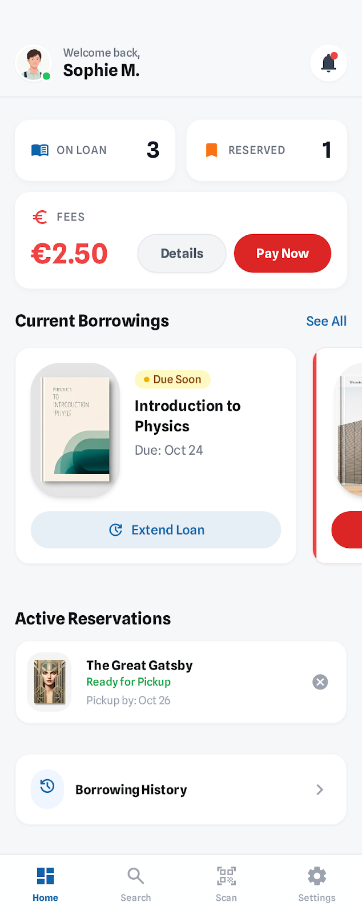
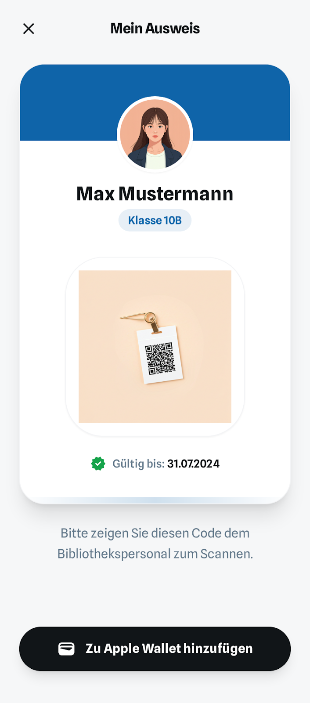

# User Story US-LEN-02-REF: My Borrowed Books (Refined)

## Story
**As a** student  
**I want to** view my currently borrowed books and their due dates  
**So that** I can keep track of my borrowings and avoid late returns

## Priority
**Must-Have** | MVP Phase 2

## UI-Prototyp (Mobile)

- HTML: [nutzer-dashboard](../../../ui/prototypes/stitch_schulbibliotheks_app/nutzer-dashboard/code.html)
- Bild:



- HTML: [mein_ausweis](../../../ui/prototypes/stitch_schulbibliotheks_app/mein_ausweis/code.html)
- Bild:



## Refinement Discussion

### Klärungspunkte & Entscheidungen

| Punkt | Entscheidung | Begründung |
|-------|--------------|------------|
| Welche Informationen anzeigen? | Buch-Details, Exemplar, Ausleih- & Fälligkeitsdatum, Status, Verlängerungsoption | Vollständige Übersicht für User |
| Historische Ausleihen zeigen? | Ja, separater Tab "History" | Ermöglicht Tracking vergangener Lektüre |
| Wie viele Einträge pro Seite? | Aktuelle: Alle (max. 3), History: 20 mit Pagination | Aktuelle sind limitiert, History kann lang sein |
| Filter für History? | Nach Jahr/Monat | Erleichtert Suche in langer Historie |
| Verlängerungsfunktion direkt? | Ja, Button in Liste | Reduziert Klicks |
| Benachrichtigungen anzeigen? | Ja, Badge bei baldiger Fälligkeit (3 Tage) | Visueller Hinweis auf Dringlichkeit |
| Sortierung? | Nach Fälligkeitsdatum (nächste zuerst) | Logisch für Priorisierung |
| Überfällige Bücher hervorheben? | Ja, rote Markierung + Warnung | Klare visuelle Unterscheidung |
| QR-Code für Rückgabe? | Nein im MVP | Could-Have für Self-Checkout |

### Tasks

#### Backend
- GET /api/v1/borrowings/me Endpoint (aktuelle Ausleihen)
- GET /api/v1/borrowings/me/history Endpoint (Historie)
- Filter- und Pagination-Parameter für History
- Status-Berechnung (active, overdue, returned)
- Sortierung nach Due-Date implementieren
- Extension-Berechtigung prüfen (nur einmal, nicht overdue)
- OpenAPI-Dokumentation

#### Frontend Web (Web Admin App – nicht zutreffend)
- Diese Story ist ein User-Flow (Schüler/Lehrkraft) und wird in der Mobile App umgesetzt; die Web Admin App bietet hierfür keine UI.

#### Frontend Mobile
- MyBooksScreen mit Tabs
- BorrowingListTile für jede Ausleihe
- Pull-to-Refresh
- Swipe-to-Extend (optional)
- Fälligkeits-Badge
- Overdue-Warning-Banner
- History-ListView mit Infinite-Scroll
- Filter-Bottom-Sheet für History
- Empty-State
- Loading-Indicators

#### Testing
- Unit-Tests für Borrowing-Queries
- API-Integration-Tests
- Frontend-Component-Tests
- E2E-Test: Ausleihe anzeigen und verlängern
- Overdue-Calculation-Tests
- Extension-Validation-Tests

## Akzeptanzkriterien

### Functional
- [ ] Benutzer sieht Liste aller aktuellen Ausleihen (Status: REQUESTED, ISSUED)
- [ ] Jede Ausleihe zeigt: Buch-Cover, Titel, Autor, Exemplar-Nr, Ausleihdatum, Fälligkeitsdatum
- [ ] Fälligkeitsdatum ist prominent dargestellt
- [ ] Überfällige Bücher werden rot markiert mit Warnung (z.B. Status "Overdue")
- [ ] Bücher können mit Status "Due Soon" gekennzeichnet werden
- [ ] Jeder Eintrag zeigt ein Datum im Format "Due: <date>"
- [ ] History-Tab zeigt alle vergangenen Ausleihen (Status: RETURNED)
- [ ] History mit Pagination (20 pro Seite)
- [ ] History-Filter nach Datum-Range
- [ ] Click auf Buch öffnet Book-Details
- [ ] Empty-State bei keinen Ausleihen: "No books borrowed yet"

### Non-Functional
- [ ] Ladezeit < 1 Sekunde für aktuelle Ausleihen
- [ ] API-Response-Time < 500ms
- [ ] Realtime-Update bei Verlängerung (keine Full-Reload)
- [ ] Mobile: Pull-to-Refresh funktioniert smooth
- [ ] UI ist responsiv
- [ ] Barrierefrei: Screen-Reader-Support

### Technical
- [ ] GET /api/v1/borrowings/me (aktuelle Ausleihen)
- [ ] GET /api/v1/borrowings/me/history?page=0&size=20&year=2026
- [ ] POST /api/v1/borrowings/{id}/extend (Verlängerung)
- [ ] Response: Liste von BorrowingDTO
- [ ] HTTP-Status: 200 (OK), 401 (Unauthorized), 400 (Bad Request)
- [ ] JWT-Token erforderlich (User aus Token extrahieren)
- [ ] Sortierung nach dueDate ASC für Current
- [ ] Sortierung nach returnDate DESC für History

## Technische Notizen

### Backend-Architektur
**Technologie**: Spring Boot, Spring Data JPA

**BorrowingRepository Enhancement**:
```java
@Repository
public interface BorrowingRepository extends JpaRepository<Borrowing, Long> {
    
    @Query("SELECT b FROM Borrowing b " +
           "JOIN FETCH b.bookCopy bc " +
           "JOIN FETCH bc.book " +
           "WHERE b.user.id = :userId " +
           "AND b.status IN ('REQUESTED', 'ISSUED') " +
           "ORDER BY b.dueDate ASC")
    List<Borrowing> findCurrentBorrowingsByUserId(@Param("userId") Long userId);
    
    @Query("SELECT b FROM Borrowing b " +
           "JOIN FETCH b.bookCopy bc " +
           "JOIN FETCH bc.book " +
           "WHERE b.user.id = :userId " +
           "AND b.status = 'RETURNED' " +
           "AND (:year IS NULL OR YEAR(b.returnDate) = :year)")
    Page<Borrowing> findHistoryByUserId(
        @Param("userId") Long userId, 
        @Param("year") Integer year,
        Pageable pageable
    );
}
```

**BorrowingDTO Enhancement**:
```java
@Data
@Builder
public class BorrowingDTO {
    private Long id;
    
    private BookSummaryDTO book;
    private CopyInfoDTO copy;
    
    private BorrowingStatus status;
    
    private LocalDate borrowDate;
    private LocalDate dueDate;
    private LocalDate returnDate;
    
    private Boolean extended;
    private LocalDate extendedDueDate;
    
    // Computed fields
    private Long daysUntilDue; // Positive = days left, Negative = days overdue
    private Boolean isOverdue;
    private Boolean isDueSoon; // ≤ 3 days
    private Boolean canExtend;
    
    private LocalDate effectiveDueDate; // extended ? extendedDueDate : dueDate
}

@Data
@Builder
public class BookSummaryDTO {
    private Long id;
    private String title;
    private String author;
    private String coverUrl;
}

@Data
@Builder
public class CopyInfoDTO {
    private Long id;
    private String copyNumber;
    private String location;
}
```

**BorrowingService Enhancement**:
```java
@Service
public class BorrowingService {
    
    public List<BorrowingDTO> getCurrentBorrowings(Long userId) {
        List<Borrowing> borrowings = borrowingRepository.findCurrentBorrowingsByUserId(userId);
        return borrowings.stream()
            .map(this::toBorrowingDTO)
            .toList();
    }
    
    public Page<BorrowingDTO> getBorrowingHistory(Long userId, Integer year, Pageable pageable) {
        Page<Borrowing> history = borrowingRepository.findHistoryByUserId(userId, year, pageable);
        return history.map(this::toBorrowingDTO);
    }
    
    private BorrowingDTO toBorrowingDTO(Borrowing borrowing) {
        LocalDate effectiveDueDate = borrowing.getExtended() 
            ? borrowing.getExtendedDueDate() 
            : borrowing.getDueDate();
        
        long daysUntilDue = ChronoUnit.DAYS.between(LocalDate.now(), effectiveDueDate);
        boolean isOverdue = daysUntilDue < 0;
        boolean isDueSoon = daysUntilDue >= 0 && daysUntilDue <= 3;
        boolean canExtend = !borrowing.getExtended() && !isOverdue;
        
        return BorrowingDTO.builder()
            .id(borrowing.getId())
            .book(toBookSummaryDTO(borrowing.getBookCopy().getBook()))
            .copy(toCopyInfoDTO(borrowing.getBookCopy()))
            .status(borrowing.getStatus())
            .borrowDate(borrowing.getBorrowDate())
            .dueDate(borrowing.getDueDate())
            .returnDate(borrowing.getReturnDate())
            .extended(borrowing.getExtended())
            .extendedDueDate(borrowing.getExtendedDueDate())
            .daysUntilDue(daysUntilDue)
            .isOverdue(isOverdue)
            .isDueSoon(isDueSoon)
            .canExtend(canExtend)
            .effectiveDueDate(effectiveDueDate)
            .build();
    }
}
```

**API Controller**:
```java
@RestController
@RequestMapping("/api/v1/borrowings")
public class BorrowingController {
    
    @GetMapping("/me")
    public ResponseEntity<List<BorrowingDTO>> getCurrentBorrowings(
        @AuthenticationPrincipal JwtAuthenticationToken token
    ) {
        Long userId = extractUserId(token);
        List<BorrowingDTO> borrowings = borrowingService.getCurrentBorrowings(userId);
        return ResponseEntity.ok(borrowings);
    }
    
    @GetMapping("/me/history")
    public ResponseEntity<Page<BorrowingDTO>> getBorrowingHistory(
        @RequestParam(required = false) Integer year,
        @RequestParam(defaultValue = "0") int page,
        @RequestParam(defaultValue = "20") int size,
        @AuthenticationPrincipal JwtAuthenticationToken token
    ) {
        Long userId = extractUserId(token);
        Pageable pageable = PageRequest.of(page, size, Sort.by("returnDate").descending());
        Page<BorrowingDTO> history = borrowingService.getBorrowingHistory(userId, year, pageable);
        return ResponseEntity.ok(history);
    }
}
```

**Response Beispiel (Current)**:
```json
[
  {
    "id": 42,
    "book": {
      "id": 1,
      "title": "Der Hobbit",
      "author": "J.R.R. Tolkien",
      "coverUrl": "https://cdn.schoollibrary.com/covers/hobbit.jpg"
    },
    "copy": {
      "id": 2,
      "copyNumber": "002",
      "location": "Regal A3"
    },
    "status": "ISSUED",
    "borrowDate": "2026-01-02",
    "dueDate": "2026-01-16",
    "returnDate": null,
    "extended": false,
    "extendedDueDate": null,
    "daysUntilDue": 14,
    "isOverdue": false,
    "isDueSoon": false,
    "canExtend": true,
    "effectiveDueDate": "2026-01-16"
  },
  {
    "id": 38,
    "book": {
      "id": 15,
      "title": "Harry Potter und der Stein der Weisen",
      "author": "J.K. Rowling",
      "coverUrl": "https://cdn.schoollibrary.com/covers/hp1.jpg"
    },
    "copy": {
      "id": 45,
      "copyNumber": "003",
      "location": "Regal B7"
    },
    "status": "ISSUED",
    "borrowDate": "2025-12-25",
    "dueDate": "2026-01-08",
    "returnDate": null,
    "extended": true,
    "extendedDueDate": "2026-01-15",
    "daysUntilDue": 13,
    "isOverdue": false,
    "isDueSoon": false,
    "canExtend": false,
    "effectiveDueDate": "2026-01-15"
  }
]
```

### Frontend-Architektur Web (Optional – kein Teil der Web Admin App)
_Hinweis: Die Web Admin App betrifft nur Admin-Stories. Diese Story ist ein Mobile-User-Flow._
**Technologie**: React, TypeScript, Material-UI

**MyBorrowedBooks Component**:
```typescript
export const MyBorrowedBooks: React.FC = () => {
  const [tab, setTab] = useState<'current' | 'history'>('current');
  const [currentBorrowings, setCurrentBorrowings] = useState<BorrowingDTO[]>([]);
  const [history, setHistory] = useState<Page<BorrowingDTO>>();
  const [loading, setLoading] = useState(true);

  useEffect(() => {
    if (tab === 'current') {
      loadCurrentBorrowings();
    } else {
      loadHistory();
    }
  }, [tab]);

  const loadCurrentBorrowings = async () => {
    setLoading(true);
    try {
      const response = await apiClient.get<BorrowingDTO[]>('/api/v1/borrowings/me');
      setCurrentBorrowings(response.data);
    } catch (error) {
      console.error('Failed to load borrowings', error);
    } finally {
      setLoading(false);
    }
  };

  const loadHistory = async (page = 0) => {
    setLoading(true);
    try {
      const response = await apiClient.get<Page<BorrowingDTO>>('/api/v1/borrowings/me/history', {
        params: { page, size: 20 }
      });
      setHistory(response.data);
    } catch (error) {
      console.error('Failed to load history', error);
    } finally {
      setLoading(false);
    }
  };

  const handleExtend = async (borrowingId: number) => {
    try {
      await apiClient.post(`/api/v1/borrowings/${borrowingId}/extend`);
      toast.success('Book extended successfully!');
      loadCurrentBorrowings(); // Reload
    } catch (error: any) {
      toast.error(error.response?.data?.message || 'Failed to extend borrowing');
    }
  };

  return (
    <Container maxWidth="lg">
      <Box sx={{ py: 4 }}>
        <Typography variant="h4" gutterBottom>
          My Borrowed Books
        </Typography>

        <Tabs value={tab} onChange={(_, value) => setTab(value)}>
          <Tab label="Current" value="current" />
          <Tab label="History" value="history" />
        </Tabs>

        {loading ? (
          <CircularProgress />
        ) : tab === 'current' ? (
          <CurrentBorrowingsTab 
            borrowings={currentBorrowings} 
            onExtend={handleExtend}
          />
        ) : (
          <HistoryTab 
            history={history} 
            onPageChange={loadHistory}
          />
        )}
      </Box>
    </Container>
  );
};

const CurrentBorrowingsTab: React.FC<{
  borrowings: BorrowingDTO[];
  onExtend: (id: number) => void;
}> = ({ borrowings, onExtend }) => {
  if (borrowings.length === 0) {
    return (
      <EmptyState 
        icon={<BookIcon fontSize="large" />}
        message="No books borrowed yet"
        action={<Button href="/catalog">Browse Catalog</Button>}
      />
    );
  }

  return (
    <Grid container spacing={3} sx={{ mt: 2 }}>
      {borrowings.map(borrowing => (
        <Grid item xs={12} key={borrowing.id}>
          <Card>
            <CardContent>
              <Grid container spacing={2}>
                <Grid item xs={12} sm={2}>
                  
                </Grid>
                
                <Grid item xs={12} sm={7}>
                  <Typography variant="h6">{borrowing.book.title}</Typography>
                  <Typography variant="body2" color="text.secondary">
                    by {borrowing.book.author}
                  </Typography>
                  
                  <Box sx={{ mt: 2 }}>
                    <Typography variant="body2">
                      <strong>Copy:</strong> {borrowing.copy.copyNumber} - {borrowing.copy.location}
                    </Typography>
                    <Typography variant="body2">
                      <strong>Borrowed:</strong> {formatDate(borrowing.borrowDate)}
                    </Typography>
                    <Typography variant="body2">
                      <strong>Due:</strong> {formatDate(borrowing.effectiveDueDate)}
                    </Typography>
                  </Box>
                </Grid>
                
                <Grid item xs={12} sm={3} sx={{ textAlign: 'right' }}>
                  {borrowing.isOverdue ? (
                    <Chip 
                      label={`${Math.abs(borrowing.daysUntilDue)} days overdue`}
                      color="error"
                      icon={<WarningIcon />}
                    />
                  ) : borrowing.isDueSoon ? (
                    <Chip 
                      label={`${borrowing.daysUntilDue} days left`}
                      color="warning"
                      icon={<AccessTimeIcon />}
                    />
                  ) : (
                    <Chip 
                      label={`${borrowing.daysUntilDue} days left`}
                      color="success"
                    />
                  )}
                  
                  {borrowing.extended && (
                    <Chip 
                      label="Extended" 
                      size="small" 
                      sx={{ mt: 1, display: 'block' }}
                    />
                  )}
                  
                  <Button
                    variant="outlined"
                    size="small"
                    disabled={!borrowing.canExtend}
                    onClick={() => onExtend(borrowing.id)}
                    sx={{ mt: 2 }}
                  >
                    {borrowing.extended ? 'Already Extended' : 'Extend (+7 days)'}
                  </Button>
                </Grid>
              </Grid>
            </CardContent>
          </Card>
        </Grid>
      ))}
    </Grid>
  );
};
```

### Frontend-Architektur Mobile
**Technologie**: Flutter/Dart

**MyBooksScreen**:
```dart
class MyBooksScreen extends StatefulWidget {
  @override
  _MyBooksScreenState createState() => _MyBooksScreenState();
}

class _MyBooksScreenState extends State<MyBooksScreen> with SingleTickerProviderStateMixin {
  late TabController _tabController;
  List<Borrowing> _currentBorrowings = [];
  bool _isLoading = true;

  @override
  void initState() {
    super.initState();
    _tabController = TabController(length: 2, vsync: this);
    _loadCurrentBorrowings();
  }

  Future<void> _loadCurrentBorrowings() async {
    setState(() => _isLoading = true);
    
    try {
      final response = await apiClient.get('/api/v1/borrowings/me');
      setState(() {
        _currentBorrowings = (response.data as List)
          .map((json) => Borrowing.fromJson(json))
          .toList();
      });
    } catch (e) {
      // Error handling
    } finally {
      setState(() => _isLoading = false);
    }
  }

  Future<void> _extendBorrowing(int borrowingId) async {
    try {
      await apiClient.post('/api/v1/borrowings/$borrowingId/extend');
      
      ScaffoldMessenger.of(context).showSnackBar(
        SnackBar(content: Text('Book extended successfully!'), backgroundColor: Colors.green),
      );
      
      _loadCurrentBorrowings(); // Reload
    } catch (e) {
      String errorMsg = e is DioError && e.response?.data['message'] != null
        ? e.response!.data['message']
        : 'Failed to extend borrowing';
      
      ScaffoldMessenger.of(context).showSnackBar(
        SnackBar(content: Text(errorMsg), backgroundColor: Colors.red),
      );
    }
  }

  @override
  Widget build(BuildContext context) {
    return Scaffold(
      appBar: AppBar(
        title: Text('My Books'),
        bottom: TabBar(
          controller: _tabController,
          tabs: [
            Tab(text: 'Current'),
            Tab(text: 'History'),
          ],
        ),
      ),
      body: TabBarView(
        controller: _tabController,
        children: [
          _buildCurrentTab(),
          _buildHistoryTab(),
        ],
      ),
    );
  }

  Widget _buildCurrentTab() {
    if (_isLoading) {
      return Center(child: CircularProgressIndicator());
    }
    
    if (_currentBorrowings.isEmpty) {
      return EmptyStateWidget(
        message: 'No books borrowed yet',
        actionLabel: 'Browse Catalog',
        onAction: () => Navigator.pushNamed(context, '/catalog'),
      );
    }

    return RefreshIndicator(
      onRefresh: _loadCurrentBorrowings,
      child: ListView.builder(
        itemCount: _currentBorrowings.length,
        itemBuilder: (context, index) {
          final borrowing = _currentBorrowings[index];
          return BorrowingCard(
            borrowing: borrowing,
            onExtend: () => _extendBorrowing(borrowing.id),
          );
        },
      ),
    );
  }

  Widget _buildHistoryTab() {
    // Similar implementation with pagination
    return Center(child: Text('History Tab - To be implemented'));
  }
}

class BorrowingCard extends StatelessWidget {
  final Borrowing borrowing;
  final VoidCallback onExtend;

  const BorrowingCard({required this.borrowing, required this.onExtend});

  @override
  Widget build(BuildContext context) {
    return Card(
      margin: EdgeInsets.all(8),
      child: Padding(
        padding: EdgeInsets.all(12),
        child: Column(
          crossAxisAlignment: CrossAxisAlignment.start,
          children: [
            Row(
              crossAxisAlignment: CrossAxisAlignment.start,
              children: [
                CachedNetworkImage(
                  imageUrl: borrowing.book.coverUrl,
                  width: 80,
                  height: 120,
                  fit: BoxFit.cover,
                ),
                SizedBox(width: 12),
                
                Expanded(
                  child: Column(
                    crossAxisAlignment: CrossAxisAlignment.start,
                    children: [
                      Text(
                        borrowing.book.title,
                        style: TextStyle(fontSize: 16, fontWeight: FontWeight.bold),
                      ),
                      Text(
                        'by ${borrowing.book.author}',
                        style: TextStyle(color: Colors.grey),
                      ),
                      SizedBox(height: 8),
                      Text('Copy: ${borrowing.copy.copyNumber}', style: TextStyle(fontSize: 12)),
                      Text(
                        'Due: ${DateFormat.yMd().format(borrowing.effectiveDueDate)}',
                        style: TextStyle(fontSize: 12),
                      ),
                    ],
                  ),
                ),
                
                _buildStatusChip(borrowing),
              ],
            ),
            
            if (borrowing.isOverdue) ...[
              SizedBox(height: 12),
              Container(
                padding: EdgeInsets.all(8),
                decoration: BoxDecoration(
                  color: Colors.red.shade50,
                  borderRadius: BorderRadius.circular(4),
                ),
                child: Row(
                  children: [
                    Icon(Icons.warning, color: Colors.red, size: 20),
                    SizedBox(width: 8),
                    Expanded(
                      child: Text(
                        '${borrowing.daysUntilDue.abs()} days overdue! Please return ASAP.',
                        style: TextStyle(color: Colors.red, fontWeight: FontWeight.bold),
                      ),
                    ),
                  ],
                ),
              ),
            ],
            
            SizedBox(height: 12),
            
            Row(
              mainAxisAlignment: MainAxisAlignment.end,
              children: [
                if (borrowing.extended)
                  Chip(
                    label: Text('Extended', style: TextStyle(fontSize: 12)),
                    backgroundColor: Colors.blue.shade100,
                  ),
                SizedBox(width: 8),
                ElevatedButton(
                  onPressed: borrowing.canExtend ? onExtend : null,
                  child: Text(borrowing.extended ? 'Already Extended' : 'Extend (+7 days)'),
                ),
              ],
            ),
          ],
        ),
      ),
    );
  }

  Widget _buildStatusChip(Borrowing borrowing) {
    if (borrowing.isOverdue) {
      return Chip(
        label: Text('${borrowing.daysUntilDue.abs()} days overdue'),
        backgroundColor: Colors.red,
        labelStyle: TextStyle(color: Colors.white),
      );
    } else if (borrowing.isDueSoon) {
      return Chip(
        label: Text('${borrowing.daysUntilDue} days left'),
        backgroundColor: Colors.orange,
        labelStyle: TextStyle(color: Colors.white),
      );
    } else {
      return Chip(
        label: Text('${borrowing.daysUntilDue} days left'),
        backgroundColor: Colors.green,
        labelStyle: TextStyle(color: Colors.white),
      );
    }
  }
}
```

## Definition of Done
- [ ] Code reviewed und genehmigt
- [ ] Alle Tests bestanden (Unit, Integration, E2E)
- [ ] API-Dokumentation (OpenAPI) aktualisiert
- [ ] User-Dokumentation erstellt
- [ ] Performance-Tests durchgeführt
- [ ] Accessibility-Tests bestanden
- [ ] Responsive Design getestet
- [ ] Security-Scan ohne kritische Findings
- [ ] Deployment in Test-Umgebung erfolgreich
- [ ] Product Owner hat Feature abgenommen

## Abhängigkeiten
- User Authentication (US01) muss implementiert sein
- Book Borrowing (US05) muss implementiert sein
- Borrowing-Tabelle mit vollständigen Daten
- E-Mail-Reminder-System (separate Story) für baldige Fälligkeiten

## Risiken & Offene Punkte
- Overdue-Berechnung muss zeitzonenunabhängig sein
- History kann sehr lang werden → Pagination und Filter wichtig
- Push-Notifications für mobile App (spätere Version)
- E-Mail-Reminder 3 Tage vor Fälligkeit → Scheduled Job (separate Story)
- Mahngebühren-Anzeige → Spätere Version mit Payment-Integration
- QR-Code für Rückgabe am Selbstbedienungs-Terminal → Could-Have
